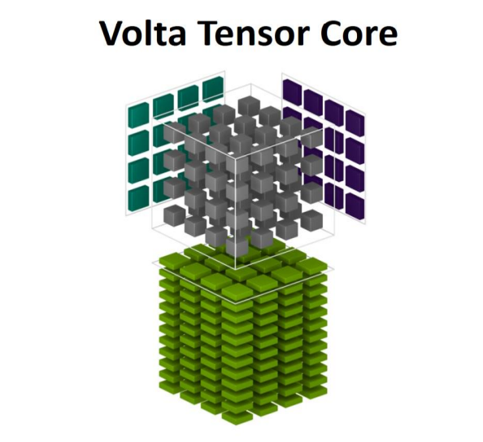
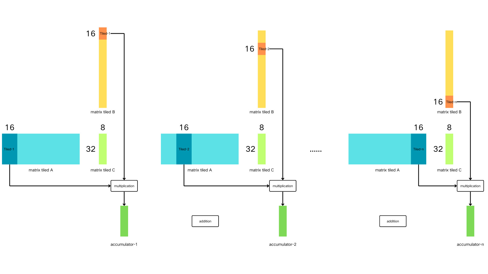
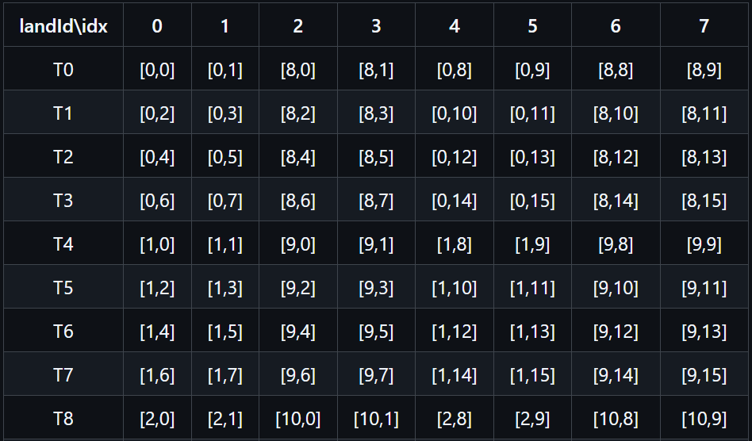

# CUDA 编程使用 Tensor core 详解

前言

最近在学习怎么使用 Tensor core.
主要通过 [NVIDIA 官方文档](https://docs.nvidia.com/cuda/cuda-c-programming-guide/index.html#warp-matrix-functions)和
[cuda-samples](https://github.com/NVIDIA/cuda-samples) 项目中关于 Tensor core 部分的实际代码示例结合其他文章做出总结,
再结合使用过程中的一些问题写出这篇文章.
本文首先解释了什么是 Tensor core 再详细说明在实际编程中如何使用 Tensor core.

---

## 什么是 Tensor core

在 2017 GPU 技术大会(GTC 2017)上, NVIDIA推出了新一代 Volta 架构,
以及使用新架构的第一款设备 : 适用于深度学习任务的加速卡 Tesla V100.
Tesla V100 GPU架构首次搭搭载了张量核心(Tensor core).
Volta 架构中每一个 SM 中在固有的 CUDA core 基础上额外搭载了8个 Tensor core.
**Tensor core 主要设计用于加速矩阵计算.**


<p style="text-align:center">Tesla V100单个SM架构图</p>

**Tensor Core 是执行矩阵乘法累加的运算单元, 并且是混合精度的计算.
将两个半精度(FP16)矩阵相乘, 并将结果累积到一个累加矩阵中.**


<p style="text-align:center">Tensor Core 执行4x4x4矩阵相乘累加</p>

每个 Tensor Core 每时钟周期能执行 4x4x4 个矩阵运算, 执行运算 **D = A * B + C**, 其中 **A, B, C, D 是 4×4 矩阵**.
A, B是半精度(FP16)的矩阵, 累加矩阵C, D可以是半精度(FP16)或单精度(FP32)的矩阵.

> 混合精度计算是指在底层硬件算子层面, 使用半精度(FP16)作为输入和输出, 使用全精度(FP32)进行中间结果计算和保存从而不损失过多精度的技术.


<p style="text-align:center">Tensor core 中的混合精度相乘和累积操作</p>

---

## 为什么使用 Tensor core

Tesla V100 单个 SM 架构图中可以看到, 单个 SM 中分为4个 sub core.
一个 sub core 中的 CUDA core 单个时钟周期可以执行 16 次 FFMA 操作.
**一个 sub core 中有两个 Tensor core, 单个 Tensor core 每个时钟可以执行 64 次 FFMA 混合精度运算(FP16 乘法与 FP32
累加). **
比起 CUDA core, 使用 Tensor core 的吞吐量提升了8倍.

> FFMA(Fused Floating-Point Multiply-Add)是一种在 GPU 上执行的高效数学运算,
> 将 32 位浮点数的乘法和加法两个操作融合在一个指令中完成, 从而提高性能和减少计算延迟.

Tesla V100 在一个 SM 单元中有8个 TensorCore, 每个时钟可执行共计 1024 次浮点运算.  
使用 Volta 架构的 V100 GPU 相比于上一代 Pascal 架构的 P100 GPU 的吞吐量一共提升了 12 倍.


<p style="text-align:center">Pascal架构和Volta架构矩阵运算速度对比</p>

CUDA core 中, 每次进行一个点和一行进行相乘依次得到新的矩阵, 而 Tensor core 中是一个矩阵和另一个矩阵直接相乘得到新的矩阵.

> 运算从依次从一行和一列进行相乘得到结果,变化到一个矩阵与另一个矩阵直接相乘得到结果, 则编程思路也要进行变化.
> 下一节说明使用 Tensor core 的思路.

---

## 分块(tilling)

矩阵乘法一般使用分块 (tilling) 技术将大矩阵划分为许多小块 (tile) 分别进行计算,
通过对小块矩阵进行乘法运算, 降低了算法的时间复杂度, 并能够更好地利用缓存.
**而每一个结果矩阵的块 (tile) 都是由**
**两个相乘矩阵 (A, B矩阵) 的块 (tile) 沿着 K 维度 (A矩阵的行, B矩阵的列) 相乘并累加得到的.**


<p style="text-align:center">计算和储存匹配CUDA模型的分层结构</p>

分块技术将 A, B 和 C 矩阵按照相对应的维度 (例如 C 块的维度是 m × n, A 块是 m × k, B 块是 k × n) 分为无数个小的矩阵块.
一个 m × n 的 C 块的结果由对应 m × k 的 A 块 和 k × n 的 B 块沿着 K 维相乘并累加得到.

如下图所示, 要计算一个 32 × 8 的 C 块, 它在结果矩阵 C 的位置是最左上角, 也就是由1~32行和1~8列组成的矩阵块.
设 k = 16, 则首先计算A矩阵的第0~31行和第0~15列组成的A块与B矩阵的第0~15行和第0~7列组成的B块相乘得到中间结果矩阵acc(
accumulator-1)块,
再计算由第0~31行和第16~31列组成的A块与第16~31行和第0~7列组成的B块相乘得到的新的acc(accumulator-2)块与上一次的acc(
accumulator-1)块做矩阵加法.
沿K维循环迭代进行, 最终遍历计算 A 矩阵第0~31行的所有数据和 B 矩阵第0~7列的所有数据得到最终结果矩阵 C 块.


<p style="text-align:center">分块矩阵相乘累加示例</p>

**使用分块技术来计算矩阵乘法最主要的操作就是两个矩阵块相乘, 将结果矩阵块累加到上一次的结果矩阵块.
Tensor core 就是用于计算矩阵相乘和累加的操作.**

将矩阵按照 Tensor core 支持的矩阵维度来分块, 随后将 A 块 和 B 块利用 Tensor core 沿着 K 维相乘累加得到结果矩阵 C 块.
再进行同样的操作来计算下一个 C 块, 最后所有的 C 块结合起来得到最终的结果矩阵.

> 也可以通过使用 cuBLAS 和 cuDNN 这两个 CUDA 库来间接使用 Tensor Cores.
> cuBLAS 利用 Tensor Cores 加速密集矩阵乘法(GEMM)计算;
> cuDNN 则利用 Tensor Cores 加速卷积和循环神经网络(RNNs)的计算.

---

## WMMA API

CUDA 9.0 引入了一个以 warp 级别进行操作的矩阵计算函数, 以便开发者可以使用 GPU 上的 Tensor Core.
称为WMMA(Warp-level Matrix Multiply and Accumulate)API.
通过 WMMA API, 可以将 D = A × B + C 运算使用 warp 级别进行操作,
其中的A、B、C、D都是更大矩阵的块(tile). 也就是可以使用一个 warp (32个线程) 来计算一个结果矩阵块.

**实际工作中, 一个warp中的每个线程都只计算结果矩阵块的8个数据(16×16/32).**

Tensor core 支持各种元素类型和矩阵维度, 下表列出了目前WMMA API支持的 matrix_a, matrix_b 和 accumulator 矩阵的部分格式和矩阵维度.


<p style="text-align:center">Tensor core WMMA API 目前支持的格式和矩阵维度</p>

> 这里只列出部分常用格式.
> Tensor core 还支持特殊格式, 详细可在官网查看 :
> [CUDA C++ Programming Guide 7.24.6. Element Types and Matrix Sizes](https://docs.nvidia.com/cuda/cuda-c-programming-guide/index.html#element-types-and-matrix-sizes)

要通过 WMMA API 来使用 Tensor core 只需要简单4个步骤 :

- 首先创建用于储存矩阵块的 fragment 类
- 将矩阵块读取到 fragment 类中
- 进行矩阵乘法累加计算
- 最后将计算结果写回到结果矩阵

> 调用前需要检查 GPU 是否带有 Tensor core, 并且在构建项目时设置对应的 GPU 架构.
> 构建方式可以查看另一篇文章 : [用 CMake 构建跨平台 CUDA C/C++ 项目](https://zhuanlan.zhihu.com/p/701581020)

WMMA API的所有函数和类型都在头文件 `mma.h` 中的 `namespace::nvcuda::wmma` 命名空间中定义.
为了简化代码的同时避免命名空间冲突, 保持 `wmma` 的显示, 只使用 `nvcuda` 命名空间.

```C++
#include <mma.h>
using namespace nvcuda;
```

---

### fragment 类

**fragment 是一个重载类, 用于储存矩阵片段(块)的数据.**

```C++
template<typename Use, int m, int n, int k, typename T, typename Layout=void> class fragment;

// examples
wmma::fragment<wmma::matrix_a, WMMA_M, WMMA_N, WMMA_K, half, wmma::row_major> aFrag;
wmma::fragment<wmma::matrix_b, WMMA_M, WMMA_N, WMMA_K, half, wmma::col_major> bFrag;
wmma::fragment<wmma::accumulator, WMMA_M, WMMA_N, WMMA_K, float> cFrag;
```

- `Use` : 用作第一个乘数的矩阵使用 `matrix_a` , 第二个乘数的矩阵使用 `matrix_b` . 当分别用作累加器C或目标累加器D时使用
  `accumulator`
- `m` , `n` , `k` : 表示参与乘法和累积操作的矩阵块的形状, 比如说矩阵A块是m×k, 矩阵B块是k×n, 矩阵C块是m×n
- `T` : 使用的数据类型. `double` , `float` , `__half` , `__nv_bfloat16` , `char` , `unsigned char`
- `Layout` : 表示矩阵是以行主序 `row_major` 或列主序 `col_major` 的形式保存在内存中, 当 `Use` 参数使用 `accumulator`
  时则不需要填写,
  默认是列主序储存

成员变量 `num_elements` 记录元素总数, 一般为8. 配合成员变量 `x` 可以遍历所有元素. 例如让储存的所有元素乘2 :

```C++
for (int idx = 0; idx < frag.num_elements; ++idx) {
    frag.x[idx] *= 2;
}
```

官方文档(CUDA C++ Programming Guide)中关于fragment类的描述说 "The mapping of matrix elements into fragment internal
storage is unspecified and subject to change
in future architectures."
也就是说通过以上方式不能准确知道遍历过程中当前 `idx` 下的 `frag.x[idx]` 在实际矩阵块中的哪个位置.

但是实际可以直接通过将同一个warp中的每个线程(lane)储存的元素全部打印出来对照查看就能知道.
以下列表是当m,n,k都分别设置为16的情况下每个线程储存原始矩阵的位置.

> Warp是CUDA中最小的执行单元, 它由一组固定数量的线程组成(在NVIDIA的Fermi架构及以后的GPU中, 一个warp包含32个线程).
> 同一个warp中, 每个线程被称为一个"lane", 术语来自于"车道"的比喻, 就像在高速公路上, 每个车道可以独立行驶一辆车.
> 每个lane可以看作是一个独立的执行路径, 它们共享warp的执行状态, 但各自有自己的寄存器和执行流.


<p style="text-align:center">m16n16k16情况下, 部分线程fragment类中储存的原矩阵块C的元素位置. 行标为laneId, 列标为fragment类的Index. 数据为[row,col]</p>

通过上图可以发现一些规律:

1. 从每个线程储存的行数上看, 线程的每两个Index储存相同的行元素, 并且Index为0~1和4~5储存了相同的行元素, 2~3和6~
   7储存了相同的行元素. 也就是每个线程只储存了两个行元素, 并且相差为8, 0~1和4~5是小一些的行数.
2. 从每个线程储存的列数上看, 线程的每两个Index储存连续的两列元素, 并且Index为0和2储存了相同的列元素, 1和3储存了相同列元素.
   也就是每个线程储存了4个列元素, 并且每两个列元素相差为8, 前4个Index储存了小一些的列数.
3. 从每个线程储存的列数与Index对比, 发现Index为偶数时, 储存的列数也为偶数, Index为奇数时, 储存的列数也为奇数.
4. 原矩阵同一行的数据由每连续的4个线程储存.
5. 0到15行数据中, 行数以8为分界线, T0储存第0行和第8行的元素, 之后根据规律③增加.
6. 0到15列数据中, 列数以8为分界线, 每个线程的每两个Index储存连续的2列的元素. 根据规律③的4个线程为一组, 组内第0号线程,
   储存0,1,8,9列元素, 第1号线程储存2,3,10,11列元素, 以此类推.

例如要找到原矩阵块中第1行第12列的是在哪个线程储存, 储存的Index是多少?
可以先**通过行数, 根据第④和第⑤条规律计算出从哪个线程ID开始储存**.

```C++
const int startLane = localRow % 8 * 4;
```

从以上公式算出[1,12]是由第4号开始的线程储存, 也就是4~7线程储存了第1行元素.

再**通过列数, 根据第④和第⑥条规律计算出在连续四个线程中的哪个线程储存了该元素**. 最终得到线程(lane)ID.

```C++
laneId = startLane + localCol % 8 / 2;
```

从以上公式算出[1,12]是由第6号线程储存. 知道了线程Id之后还需要知道属于fragment类中的哪个Index储存.

最后**根据第①, ②和③条规律计算出元素所在fragment类中的Index**.

```C++
const int isBigRow = localRow / 8;
const int isBigCol = localCol / 8;
index = isBigCol * 4 + isBigRow * 2 + localCol % 2;
```

最终得到第1行第12列的数据由fragment类的Index为4的第6号线程储存.

以上规律虽然说可能会在未来的架构中改变, 但是在短时间内大概率不会进行更改. 并且未来更改了也可以根据这样的方式找到计算的方法.

---

### 加载矩阵数据

`load_matrix_sync()` 函数用于从内存加载矩阵的片段到 fragment 类中. 并且**开始前会进行线程同步(sync)操作.**

```C++
void load_matrix_sync(fragment<...> &a, const T* mptr, unsigned ldm);
void load_matrix_sync(fragment<...> &a, const T* mptr, unsigned ldm, layout_t layout);
```

- `a` : 函数输出. 储存矩阵片段的 fragment 类
- `mptr` : 必须是一个 256 位对齐的指针, 指向内存中矩阵第一个要加载的元素
- `ldm` : 表示元素在连续行(行主序时)或列(列主序时)在内存中的跨度. 也就是每行/列的元素数量
- `layout` : 指定矩阵是以行主序或列主序的形式保存在内存中, 必须指定为行主序 : `mem_row_major` 或列主序 : `mem_col_major`

> 注意 : 因为会进行线程同步操作, 此函数必须由 warp 中的所有线程调用.

如果**要加载的块不满足对应的矩阵维度, 结果将出错**. 也就是说要保证输入矩阵块的大小和 fragment 类的参数相匹配.
例如指定的fragment类的m,n,k分别为32,8,16, 那么加载的矩阵块A的大小必须是32×16, 矩阵块B的大小必须是16×8.

> 特别是在进行K迭代时, 要注意是否超过了原始矩阵的大小.

---

### 矩阵计算

`mma_sync()` 函数进行矩阵乘法累加计算. 会在**开始前进行线程同步(sync)操作.**

```C++
void mma_sync(fragment<...> &d, const fragment<...> &a, const fragment<...> &b, const fragment<...> &c, bool satf=false);
```

- d , a , b , c : 表示对应的矩阵片段
- satf :  饱和有限值模式, 也就是安全模式. 默认为 `false` , 如果设置为 `true` , 则目标累加器有以下额外的数值属性 :
    - 如果一个元素的计算结果为正无穷, 则对应的累加器将会包含 `+MAX_NORM`
    - 如果一个元素的计算结果为负无穷, 则对应的累加器将会包含 `-MAX_NORM`
    - 如果一个元素的计算结果为 NaN, 则对应的累加器将包含 `+0`

> 矩阵之间片段的形状必须匹配, 也就是参数 `m` , `n` , `k` 需要相匹配.

将 A 块和 B 块相乘, 结果累加到 acc 块中 :

```C++
mma_sync(accFrag, aFrag, bFrag, accFrag);
```

> 注意 : 因为会进行线程同步操作, 此函数必须由 warp 中的所有线程调用.

---

### 存储矩阵数据

`store_matrix_sync()` 函数与 `load_matrix_sync()` 函数相反, 是将矩阵片段存储回内存中. 也会在开始前进行线程同步(sync)操作.

```C++
void store_matrix_sync(T* mptr, const fragment<...> &a, unsigned ldm, layout_t layout);
```

- `mptr` : 必须是一个256位对齐的指针, 指向数据储存的第一个位置
- `a` : 源矩阵片段 fragment 类
- `ldm` : 表示元素在连续行(行主序时)或列(列主序时)在内存中的跨度. 也就是每行/列的元素数量
- `layout` : 指定矩阵是以行主序或列主序的形式保存在内存中, 必须指定为行主序 `mem_row_major` 或列主序 `mem_col_major`

> 注意 : 因为会进行线程同步操作, 此函数必须由 warp 中的所有线程调用

---

### 填充矩阵数据

`fill_fragment()` 是用于对矩阵片段 `fragment<>` 类进行操作, 可以用常量值 `v` 来填充整个矩阵片段.

```C++
void fill_fragment(fragment<...> &a, const T& v);
```

一般用于对创建的 fragment 类进行初始化, 例如将记录中间结果的 acc 块先初始化为 0 :

```C++
wmma::fragment<wmma::accumulator, WMMA_M, WMMA_N, WMMA_K, float> accFrag;
wmma::fill_fragment(accFrag, 0.0f);
```

---

## cuBLAS 库使用 Tensor core

使用 cuBLAS 库先要创建...........
目前只有 GEMM 操作支持使用 Tensor core, 要使用 Tensor core 需要设置数学模式为 : `CUBLAS_TENSOR_OP_MATH` .

```C++
cublasSetMathMode(cublasHandle, CUBLAS_TENSOR_OP_MATH);
```

A, B 和 C 矩阵都默认为列主序储存

参数:

- `CUBLAS_OP_N` : 非转置操作
- `CUBLAS_OP_T` : 转置操作
- `CUBLAS_OP_C` : 共轭转置操作

> 共轭转置 : 要理解共轭转置首先要了解什么是实数什么是虚数.
> 实数是可以在数轴上面表示的数, 也就是平常接触到的数, 可以进行标准的加减乘除操作.
> 复数是由实数和虚数部分组成的数, 基本形式为 a + b * i ,
> 其中 a 是实部(可以是任何实数), b 是虚部(可以是任何实数), i 是虚数单位(满足 i² = -1 ).
> 实数是复数的一个子集(也就是 b = 0 时). 复数在实数系统中无法表示,
> 复数的引入扩展了数学的边界, 使得能够解决一些在实数范围内无法解决的问题.
> 而共轭转置就是将一个复数 a + b * i 变为 a - b * i

---

## 示例

下面是使用WMMA API计算稠密矩阵-稠密矩阵乘法的示例. 其中矩阵A和矩阵B的类型为half, 结果矩阵C的类型为float.
矩阵块维度m,n和k都是16. 所有矩阵都以行主序储存.

```C++
// According to the planning of cuda thread blocks, 
// calculate the row id and column id of the resulting matrix block C to be computed by the current warp.
int cRow, cCol;

wmma::fragment<wmma::matrix_a, WMMA_M, WMMA_N, WMMA_K, half, wmma::row_major> aFrag;
wmma::fragment<wmma::matrix_b, WMMA_M, WMMA_N, WMMA_K, half, wmma::row_major> bFrag;

wmma::fragment<wmma::accumulator, WMMA_M, WMMA_N, WMMA_K, float> accFrag;
fill_fragment(accFrag, 0.0f);

// All matrices are stored in row-order
const int lda = K;
const int ldb = N;
const int ldc = N;

for (int kIter = 0; kIter < K; kIter += WMMA_K) {
const int aRow = cRow;
const int aCol = kIter;

const int bRow = kIter;
const int bCol = cCol;

// bounds checking
if (aRow < M && aCol < K && bRow < K && bCol < N) {
const half* aOffsetPtr = mtrA + aRow * lda + aCol;
const half* bOffsetPtr = mtrB + bRow * ldb + bCol;

load_matrix_sync(aFrag, aOffsetPtr, lda);
load_matrix_sync(bFrag, bOffsetPtr, ldb);

mma_sync(accFrag, aFrag, bFrag, accFrag);
}
}

float* cOffsetPtr = mtrC + cRow * ldc + cCol;

store_matrix_sync(cOffsetPtr, accFrag, ldc, wmma::mem_row_major);
```

---

参考:

[1] [Tips for Optimizing GPU Performance Using Tensor Cores](https://developer.nvidia.com/blog/optimizing-gpu-performance-tensor-cores/)

[2] [CUDA C++ Programming Guide:7.24. Warp Matrix Functions](https://docs.nvidia.com/cuda/cuda-c-programming-guide/index.html#warp-matrix-functions)

[3] [NVIDIA TESLA V100 GPU ARCHITECTURE](https://images.nvidia.cn/content/volta-architecture/pdf/volta-architecture-whitepaper.pdf)

[4] [PTX ISA 8.5: 9.7.15.4.1. Matrix Fragments for mma.m8n8k4 with .f16 floating point type](https://docs.nvidia.com/cuda/parallel-thread-execution/#matrix-fragments-for-mma-m8n8k4-with-f16-floating-point-type)