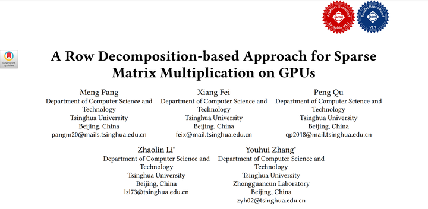
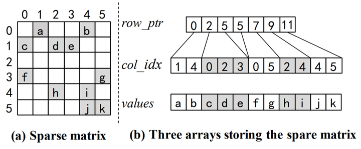
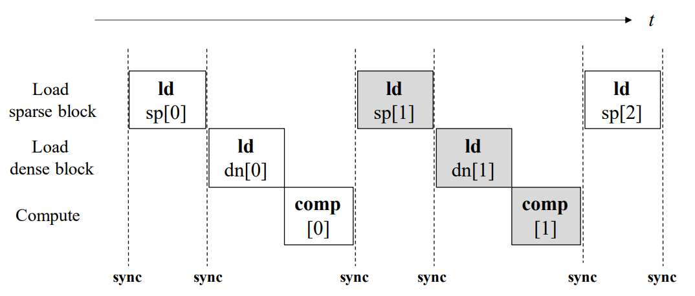
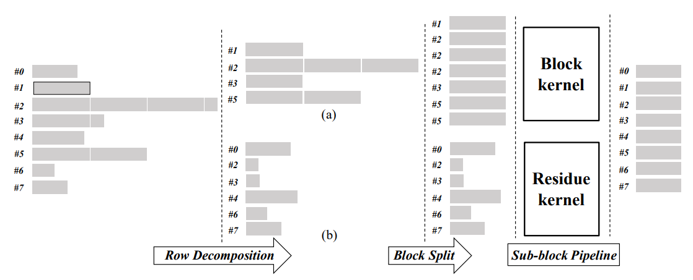
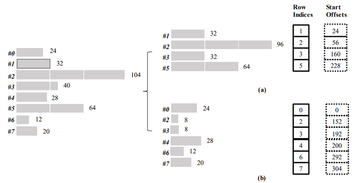
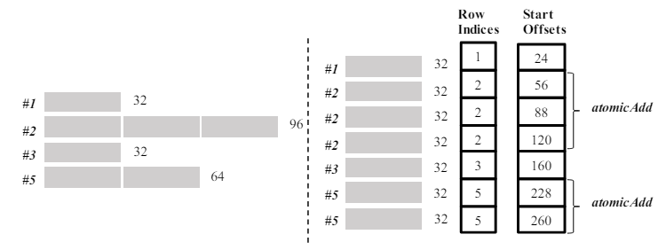
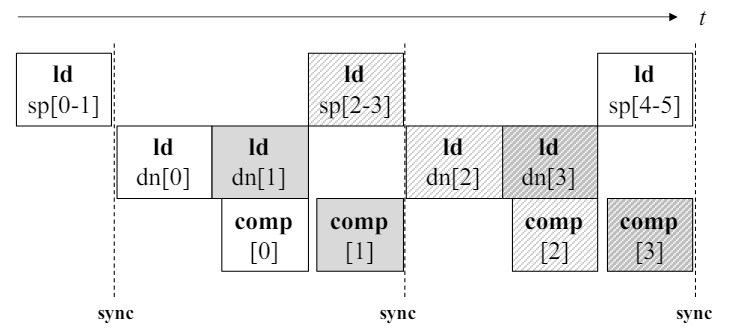
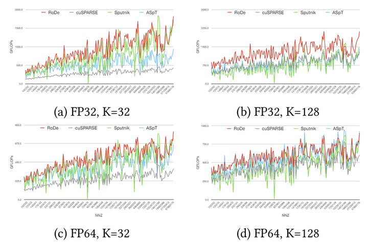

# [论文笔记]基于行分解的GPU稀疏矩阵乘法

**A Row Decomposition-based Approach for Sparse Matrix Multiplication on GPUs**

论文于2024年发表在PPoPP '24: Proceedings of the 29th ACM SIGPLAN Annual Symposium on Principles and Practice of Parallel Programming.

稀疏矩阵稠密矩阵乘法(SpMM)和采样稠密-稠密矩阵乘法(SDDMM)是各种计算领域中重要的稀疏核. 论文提出了一种**基于行分解(RoDe)的方法来优化GPU上的两个内核**.使用了标准的压缩稀疏行(CSR)格式. 具体来说,**RoDe将稀疏矩阵行划分为规则部分和残差部分, 分别充分优化它们的计算.还设计了相应的负载均衡和细粒度流水线技术**.与最先进的替代方案相比, Rode的SpMM内核最高达到7.86倍加速, SDDMM内核最高达到8.99倍加速.

文章链接: [[论文笔记]基于行分解的GPU稀疏矩阵乘法](https://zhuanlan.zhihu.com/p/703369002)

***

## 图形处理器(GPU)

物理上, **GPU是由一组流式多处理器(SMs)组成. GPU内核中, 线程(threads)被分成很多个线程块(thread blocks), 在每个线程块(thread blocks)内连续的32个线程组成一组, 称为线程束(warp)**.

> 线程束(warp)是SM中的最小执行单位. 在一个线程束中, 所有线程按照单指令多线程(SIMT)的方式执行, 也就是32个线程在同时同步执行，线程束中的每个线程执行同一条指令，包括有分支的部分, 但是处理的数据为私有的数据. 如果一个 warp 内的线程产生分支,该 warp 将执行每一个分支路径, 同时禁用不在该路径上的线程.


从逻辑角度和硬件角度描述了CUDA编程模型对应的组件. 图片来自谭升的博客.

当内核在GPU上开始执行时, 线程块以最大化并行性和最小化资源冲突的方式分配给可用的SMs. 在每个SM中, GPU调度器进一步将分配的线程块划分为warp. 每个warp由warp调度器(warp scheduler) 安排执行, 一旦选择执行某个warp, SM的指令调度程序接收这个 warp 的指令, 并将其分配给SM中的执行单元, 以便执行这些指令. GPU可以通过在SM内调度warp来隐藏指令的延迟.

> 每个SM上有非常多的执行单元. 如果某个warp中的线程需要等待数据或发生分支时, warp调度器可以选择其他准备好执行的warp来执行. 利用其他warp的执行来保持执行单元的忙碌状态, 有效地隐藏了指令延迟, 提高GPU的利用率.

GPU有一个大但是高延迟的全局内存, 所有SMs都可以访问它. 一个L2缓存由所有SMs共享, L1缓存位于每个SM的本地.  一个线程块内的所有线程都可以访问同一块共享内存, 并且每个线程都有本地寄存器.

> 同一个线程块内的线程除了都可以访问同一块共享内存外, 在同一个线程束中的线程还可以通过 shuffle 指令进行通信. 通过 suffle 指令, 两个线程间可以相互访问对方的寄存器, 并且延迟极低, 不消耗内存.

当一个warp中的多个线程访问连续的全局内存位置时, GPU可以将这些访问合并到一个事务中, 以提高效率.  每个线程还可以使用单个向量内存指令加载多个数据(例如, 一次加载4个浮点数)

***

## Sparse-Matrix Dense-Matrix Multiplication

稀疏-稠密矩阵乘法(SpMM)是线性代数中的常见操作, 在科学计算, 机器学习等领域有着广泛的应用.

**稀疏矩阵在存储上通常使用特殊的数据结构来优化内存使用和计算效率**，因为它们包含大量的零元素. 例如, 压缩稀疏行(Compressed Sparse Row, CSR), 压缩稀疏列(Compressed Sparse Column, CSC), 坐标列表(Coordinate List, COO)等. **论文中采用按行压缩的CSR表示**, 这是稀疏矩阵中使用最广泛的数据结构之一.



稀疏矩阵和对应的CSR表示.

矩阵只储存非零元素, 行指针数组`row_ptr`中的每个元素指向值数组中对应行的第一个非零元素的位置，列索引数组`col_idx`存储了非零元素的列位置，而值数组`values`则存储了所有非零元素的数值.

> 例如, 取第4行的所有元素, 并获取对应列号:

```C++
int row = 4;
for(int idx = row_ptr[row]; idx < row_ptr[row + 1]; ++idx){ // idx : 7, 8
    const auto val = values[idx]; // val : h, i
    const int col = col_idx[idx]; // col : 2, 4
}
```

***

## Sampled Dense-Dense Matrix Multiplication

采样稠密-稠密矩阵乘法(SDDMM)具有一个稀疏矩阵和两个稠密矩阵作为输入,一个稀疏矩阵作为输出. 采样指的是对两个稠密矩阵乘法的结果矩阵中随机保留一些元素. **SDDMM计算两个稠密输入矩阵的乘积, 但仅根据输入稀疏矩阵对应的非零位置处进行计算, 并与对应位置的非零权重值相乘**.

> 关于SDDMM具体介绍可以参考另一篇笔记: [CX98：[论文笔记]用于高性能机器学习的抽样稠密矩阵乘法](https://zhuanlan.zhihu.com/p/699010780)

***

## 分析非零分布
分析来自 SuiteSparse 集合的稀疏矩阵的每一行中的非零分布.
> SuiteSparse 是一个大型的稀疏矩阵集合, 它包含了许多实际应用中的稀疏矩阵.


左图显示每个矩阵的平均行长(每行非零元素的数量). 中间图绘制了每个特定行的长度分布. 右图显示每个矩阵内的行数分布. 数据集来自SuiteSparse.

得出**数据集中稀疏矩阵的三个属性:**
- **大多数矩阵的平均行长都小于32(红线)**
- **大部分行都很短(84%的行长度小于32), 但也有一些行长度达到几千甚至上万**
- **很多矩阵主要由短行组成, 包含少量的长行**

属性①导致难以充分利用GPU的计算或内存访问资源, 减少了一些可优化的空间.

> 上面提到SM的最小执行单位是线程束(warp), 一个warp由32个线程组成, 32个线程同时同步执行指令. 按照一个线程计算一个非零元素, 一行中的非零元素少于32个导致有很多线程处于空闲状态.

属性②表示对长行进行优化是有益的. 可以用向量内存指令和更多的线程来优化这些行.

> Vector Memory Instructions(向量内存指令)是GPU编程中的一种技术, 它允许单个线程使用一条指令从内存中加载多个数据元素(例如一次性加载4个浮点数). 这种技术可以提高内存访问的效率，因为它减少了访问内存的次数, 同时利用了GPU的SIMD(单指令多数据)特性.

属性③指出, 对于很多矩阵, 属性①和属性②是共存的. 意味着应该在一次计算中同时优化它们. 并且长短行的数量差距很大, 需要积极的负载均衡.

**结论: 需要同时优化长,短行, 避免优化不彻底, 同时负载均衡也很重要.**

***

## 分析计算管道

GPU上进行矩阵求解时, 通常利用分块(tiling)技术, 将稀疏矩阵和稠密矩阵划分为多个块(tile), 每个块(tile)只包含矩阵的一部分行和列. 随后迭代计算每个块, 并将其结果累加到结果块中.

> 分块(tiling): 指的是将大数据集(如矩阵)划分为较小的块(tile)(或称为瓦片). 这些小块的大小通常与GPU的共享内存大小相匹配，以便可以完全加载到共享内存中. 是常用的优化技术.



常见的稀疏稠密矩阵乘法计算流水线.

如图所示GPU上稀疏稠密矩阵乘法主要分为三个阶段: 加载稀疏块, 加载稠密块和计算.

由于要利用稀疏块内的列索引来加载稠密块, 最终的计算则需要完成对稠密块的加载, 这三个阶段表现出紧密的数据依赖关系. 为了使稀疏块在线程之间重用, 一般将其放在共享内存中, 由不同的线程加载稀疏块的不同部分, 这就需要线程间的同步操作`syncthreads`.

但上述**同步限制了编译器的优化空间, 并且稠密块中更大的数据量使得在加载稠密块时, 管道经常会出现停顿**. 通过 Nvidia Nsight Compute 分析得出, warp 需要花费几倍的时间周期的延迟在等待稠密块数据的计算指令上. **如果能在内存访问的延迟内执行更多的指令或更多的计算, 对这部分会有很好的提速效果**.

> Warp准备好执行下一条指令所需的时钟周期称为延迟, warp 调度器可以在这些延迟周期内, 向其他 warp 发出指令, 从而实现资源的充分利用, 这种方法被称为延迟隐藏.

***

## RoDe

行分解(RoDe)方法旨在使用CSR表示法在GPU上加速稀疏矩阵乘法. 主要分为三个部分: 行分解(Row Decomposition), 块分割(Block  Split)和子块流水线(Sub-block Pipeline).



RoDe方法工作流程.

**先将稀疏矩阵的行分解(Row Decomposition)为块部分(a)和残差部分(b), 分别进行处理. 将块分割(Block Split)方法应用于块部分以实现负载平衡. 最后构建子块流水线, 在连续的同步之间执行更多的操作, 以更好的隐藏内存访问延迟.**

***

### 行分解(Row Decomposition)

根据分析稀疏矩阵的非零分布得出的属性③, **将长短行分开进行处理**. 但并没有将长短行直接分成两组, 而是**把每行都分成块部分(block part)和残差部分(residual part). 将这两部分分开组合, 独立进行处理**.



行分解的一个例子. (a)为块部分(非零元素数量为32的倍数), (b)为残差部分(将一行元素数量与32取余,余数为残差部分). 虚线方框表示在实际实现中不需要储存.

> 例如第二行有104个非零元素, 将元素数量与32取余, 104%32 = 8. 则第二行最后8个非零元素为残差部分, 前96个元素为块部分.

为每个部分使用两个辅助数组来实现行分解:
- rowIndexes: 将每个部分的行索引储存在稀疏矩阵中.
- StartOffset: 储存每个部分中每行起始元素的索引.(在实际实现中, 可以在运行时被推算出来).

通过将行分解为块部分和残差部分, 可以分别对属性①和②进行优化. 使用具有较大线程块的内核处理块部分, 使用具有较小线程块的内核处理剩余部分.

> 行分解使得每行的两个部分可以单独处理, 从而提高了GPU资源的利用率.

***

### 块分割(Block  Split)

属性②和③说明单个矩阵中, **不同行的长度差异很大, 需要良好的负载均衡**.

在行分解的基础上引入了块分割(block split)方法. **将块部分的每一行划分为固定长度的分段, 数组`RowIndices`记录每个分段的行索引.`StartOffsets`储存每个分段中第一个元素的起始索引**.



块分割的例子. `RowIndices`储存行索引, `StartOffsets`储存对应的起始下标.

块分割后, 每行的元素被分割成连续的分段,将每个分段视为一个独立的行进行处理, 并且使用`atoMicAdd`指令将每个段的结果累积到最终输出中.

**每个分段中连续的数据储存有利于GPU上线程的联合内存访问. 并且每个分段都有相同数量的元素, 更容易实现负载均衡**. 生成这两个数组只需要花费很小的预处理操作.

***

### 子块流水线(Sub-block Pipeline)

由于全局内存访问的长延迟, 常见的负载计算流水线可能会收到性能限制. 论文引入了子块流水线方法, 用以更好地重叠共享内存访问, 全局内存访问和计算. 原理是**在内存访问的延迟内, 发出尽可能多的指令和执行尽可能多的计算**.



子块流水线. 每个块的左边缘表示指令发出的时间. 例如ld dn[1]在comp[0]之前发出.

为了确保数据重用, 选择将稀疏块加载到共享内存中, 而将密集块直接加载到寄存器中. 各个线程加载一部分稀疏块,并且合并到共享内存中. 由于加载密集块时需要稀疏块的列标, 因此在加载密集块前的同步操作是不可避免的.

对于图中的例子, 将密集块划分为两个子块dn[0]和dn[1], 首先加载dn[0], 然后在加载子块dn[1]的同时计算子块[0]. 在加载稀疏块sp[2]和sp[3]时同时计算子块[1].

**这个方法构建了一个更精细的流水线, 将加载内存和计算交错进行, 有效扩展了指令的重叠空间, 更好的使用计算资源**. 再次通过 Nvidia Nsight Compute 分析, 花费的等待时间周期明显减少.

> 扩展了指令的重叠空间意味着更能利用warp调度器的调度能力, 实现资源的充分利用, 能够更好地隐藏延迟.

***

## RoDe性能测试

- 环境: CUDA 11.2  Nvidia A100-PCIE-40GB GPU. CUDA代码使用带有-O3标志的NVCC 11.1进行编译
- 数据集: SuiteSparse集合中选择900多个矩阵, 这些矩阵至少有10K行,10K列和100K个非零. 矩阵来自不同的应用领域, 包括科学计算, 图形处理, 图形挖掘等, 并且包含广泛的稀疏模式
- 比较方法 : 与Nvidia cuSPARSE库, ASpT和Sputnik进行比较. 对内核执行时间和与处理时间分别进行分析. 所有测试都连续运行10次得到平均值

***

### SpMM内核



SpMM性能结果. 图中每个点表示连续5个矩阵集的平均GFLOP.

- cuSPARSE基线上的加速：RoDe实现了特定情况下高达32.17倍的加速. 几何平均值为1.91倍.
- Sputnik基线上的加速：RoDe实现了特定情况下高达198.51倍的加速. 几何平均值为1.83倍.
- ASpT基线上的加速：RoDe实现了特定情况下高达8.02倍的加速. 几何平均值为1.45倍.

***

### SDDMM内核


SDDMM性能结果. 图中每个点表示连续5个矩阵集的平均GFLOP.

与ASP相比, FP32(K=32)和FP32(K=128)的两种情况下, RoDe实现了高达8.99倍和8.80倍的加速, 几何平均值分别为1.54倍和1.44倍.

***

## 结语

论文首先分析了稀疏矩阵的跨行分布特性, 总结出将长短行分别进行优化和负载均衡的重要性. 利用行分解技术解耦了块部分和残差部分, 引入了新的负载均衡和更细致的计算流水线技术对稀疏矩阵乘法进行进一步优化.

可能有理解或表述不当的地方, 欢迎大家指正.

论文链接: [A Row Decomposition-based Approach for Sparse Matrix Multiplication on GPUs](https://dl.acm.org/doi/10.1145/3627535.3638470)
