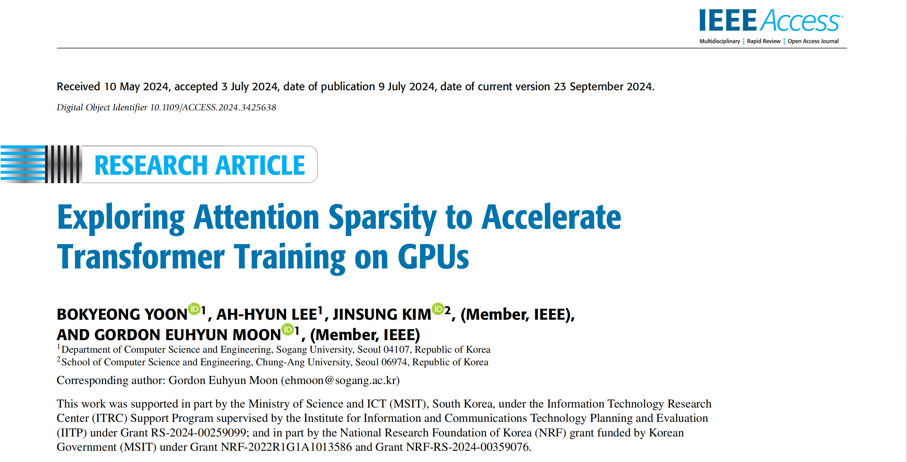
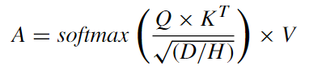
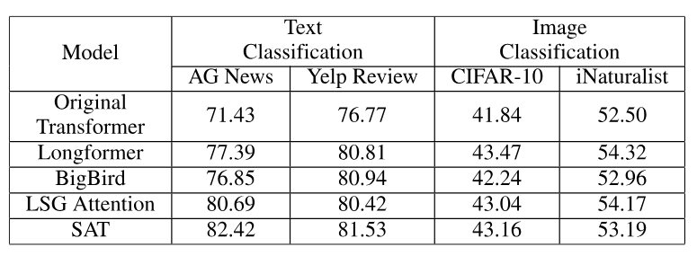
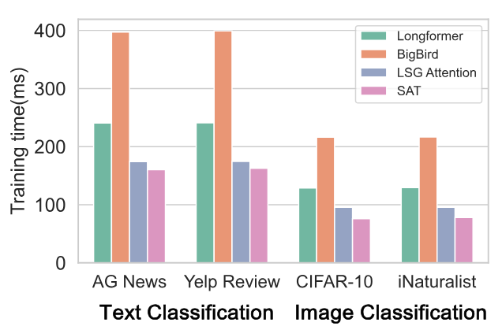

# [论文笔记]探索注意力稀疏性以加速GPU上的Transformer训练

Exploring Attention Sparsity to Accelerate Transformer Training on GPUs

---

## 简介

Transformer是一种用于解决各种序列任务(包括序列分类和序列到序列任务)的先进神经网络.
为了捕捉序列中数据节点之间的关系, Transformer在训练过程中需要大量的多头注意力(MHA)操作.
特别是,MHA操作的计算复杂度随着输入序列长度的增长而呈二次方增长.
因此, 先前的几种方法视图通过稀疏化注意力得分矩阵来降低计算复杂度并提高MHA计算的数据局部性.

---

## 背景与相关工作

### 变压器

仅编码器的Transformer是Transformer模型的一种变体, 被用于涉及多种分类任务的场景, 包括但不限于文本和图像数据集.
算法1展示了原始仅编码器的Transformer的前向传播伪代码,
其中每个编码器层由一个多投注意力(MHA)子层(2~10行)和一个前瞻子层(11~12行)组成.
对于每个编码器层, 输入嵌入E通过应用层归一化(第2行)转换为X,
然后通过在嵌入X上计算线性变化生成查询(Q), Key(K), 和值(V)(第3行).
此后, 将L,D和H分别表示为输入序列的长度, 每个数据点的嵌入大小以及头的数量.

为了高效执行MHA计算, 每个Q,K,D和V矩阵沿D维度被划分为H个子矩阵(多头)(第4行). 多头的使用表明输入序列的嵌入被划分为多个子空间.
这种划分使模型能够并行执行MHA(5~8行), 同时准确地捕捉每个子空间中的不同关键特征. 5~8行循环执行公式1所示的MHA计算.

### 相关工作

为了降低计算原始注意力矩阵$A^r$所占用的内存和计算复杂度, 在过去提出了多种稀疏注意力方法.

稀疏变换器(Sparse Transformer)使用分解注意力机制, 为不同类型的输入创建了独特的稀疏模式.
对于具有周期性结构的数据(例如图像), 它结合了袋装注意力和步幅注意力.
相反, 对于没有周期性模式的数据(例如文本), 它将块局部注意力和全局注意力相结合, 全局节点是输入序列中的固定点.

长序列变换器(Longformer)通过映入膨胀滑动窗口对稀疏变换器进行了改进.
通过在滑动注意力窗口过程中间间歇性地跳过数据点, 扩大了感受野, 从而允许更广泛的数据点交互.

> 感受野(receptive field): 表示一个 token 能"看到"(即 attend)的其他 token 的范围.
> 如果每个 token 只能看左边 64 个 token, 它的感受野就是 64.

Reformer模型使用局部敏感哈希(LSH)来确定规定查询可以关注哪些键值对. 这种LSH注意力机制确保每个标记仅与具有相同哈系统的其他标记进行交互.
该过程高阔对查询和键应用LSH函数, 并将它们分组到多个桶中, 这种哈希函数的设计增加了相似项被放入同一桶中的概率.

扩展型转换器构造(Extended Transformer Construction)和BigBird模型引入了新颖的全局注意力形式,
使得任何给定的数据点都能与序列中的所有其他点计算相似度.
ETC特别指出了三种不同的固定稀疏模式: 全局-全局, 全局-局部, 局部-全局.
BigBird创新性地引入了随机注意力模式, 即随机选取数据点进行相似性评估, 进一步丰富了这些模型中的注意力策略.
LSG注意力机制动态结合了局部, 稀疏和全局注意力机制, 使其非常适合长文本摘要和分类等任务.
与采用固定稀疏模式的BigBird不同, LSG注意力机制不仅使用固定模式, 还利用哈希和聚类技术动态选择重要标记.
这种灵活性使其能够自适应地聚焦于数据的相关部分.

LongCoder模型采用了一种专门用于完成程序代码的固定稀疏模式,

上述所有特定领域的静态稀疏注意力机制都存在不可避免的局限性. 由于静态稀疏注意力方法在所有编码器层中应用固定的稀疏模式,
因此针对特定层动态计算多投注意力(MHA)操作的变得很有挑战性. 此外, 专门用于文本分类的静态稀疏注意力并不适用于图像分类.
例如, 如果将云本为文本分类任务开发的静态滑动窗口注意力用于图像分类任务, 可能会对模型收敛产生负面影响.
在训练过程中, 如果使用与特定任务不相关的稀疏注意力方法, 可能会错过需要保留的关键特征. 因此,
确定适用于不同数据类型的数据集和任务的逐层稀疏模式对于提高Transformer模型的质量至关重要.

---

## 动机

为了识别多头自注意力(MHA)操作中的稀疏模式, 论文使用了用于图像分类的预训练视觉变换器(ViT)和文本处理的预训练BERT模型进行了文本分类.
ViT是在ImageNet-21K图形数据集上进行预训练的, 而BERT则是在维基百科和BookCorpus文本数据集上进行预训练的.
图1展示了在微型微调的第一个时期中, 随机选取的图像和文本分类任务的注意力得分矩阵$A^s$.
在微调过程中, 使用CIFAR-10退选哪个数据集进行图像分类, 使用MRPC文本数据集进行文本分类任务.

结果清晰表明, 矩阵$A^s$中的大多数元素都接近于0, 并且在不同数据集合任务中, $A^s$的稀疏模式各不相同.
这表明输入序列中只有少数数据点之间存在关联, 并且这种关联可能因数据集和任务的不同而有所变化.

如图1左侧所示, 图像分类任务的注意力得分矩阵在对角线上呈现较大的值, 这表明数据点于其自身更具有相关性.
此外, 在对角线附近的对角线上也显示出较大的值, 这表明相邻的数据点之间存在重要的关系.
而且, 由于图像数据的二维特性(不含RGB通道), 矩阵中对角线的模式呈现出一致的间隔, 其中垂直相邻的数据点可能具有显著的关系.

图1右侧所示, 从文本分类任务中获得的注意力得分矩阵在右侧大多为0值. 会议这是因为文本数据通常长度不宜, 可能需要相对较短的输入序列进行填充.
因此, 这些这些零填充数据点的注意力得分矩阵的值为0. 此外, 由于主对角线上的值较大, 表明自身之间的关系很重要, 这与图像分类任务相似.
另外, 具有较大的值的较粗对角线可以解释为更多的相邻数据点之间存在显著的关系.

基于实验, 认识到对于特定领域的数据集和任务, 动态捕捉注意力得分矩阵的稀疏模式是必要的的.

---

## SAT: 稀疏感知性变压器

### SAT概述

在本小节中, 将对新SAT模型进行高层次概述, 该模型在训练Transformer期间能够动态识别注意力得分矩阵的稀疏模式,
并对标准的多头注意力(MHA)操作进行稀疏化处理. SAT模型能够在从头开始训练模型或使用预训练的Transformer进行微调的过程中对MHA操作进行稀疏块化处理.
如图2a所示, 将SAT的整体训练过程分为三个阶段: 稠密MHA训练遵循与原始Transformer相同的训练流程, 对MHA中的所有元素进行操作.
在稠密MHA训练阶段, 与标准MHA类似, 会执行两次稠密矩阵-稠密矩阵乘法(GEMM)操作以及一次标准的softmax计算(图2b),
直到每个编码器层的注意力得分矩阵$A^s$展现出特定的稀疏模式.

在密集注意力阶段, SAT实现使用NVIDIA的cuBLAS库以及GPU上的张量核心来加速密集多投注意力(MHA)操作.
该操作涉及密集矩阵Q和K的乘法, 以及密集矩阵A和V的乘法.
此外, 在密集MHA训练阶段, 还训练稀疏参数以捕获注意力得分矩阵中的逐层稀疏模式. 为了确定密集MHA阶段和稀疏MHA阶段之间的最佳转折点,
在密集MHA阶段, 计算注意力得分矩阵$A$中值的偏度, 并测量前一步i-1和当前步i生成的注意力得分矩阵A之间的弗罗贝尼乌斯距离.
当偏度程度和距离值满足预定义的阈值时, SAT根据密度MHA训练阶段训练的稀疏参数生成稀疏矩阵P(生成方法方法在下一节描述).

> 弗罗贝尼乌斯距离(Frobenius Distance): 用来衡量两个矩阵之间差异(距离)有多大的指标.

此后, 如图2a所示, SAT模型利用生成的稀疏模式, 继续使用稀疏MHA(图2c)进行训练, 直至收敛,
在稀疏MHA训练阶段, 给定矩阵Q和K以及生成的稀疏矩阵P, 执行SDDMM操作以生成稀疏化注意力矩阵$S^r$.
应用稀疏softmax操作后, 由于得分注意力矩阵$S^s$任然是稀疏矩阵, 利用SpMM操作将稀疏矩阵$S^s$和稠密矩阵V相乘.
为了加速稀疏MHA训练阶段, 利用NVIDIA cuSPARSE库执行加速的SDDMM和SpMM计算.
并且还实现了一个高效的CUDA内核用于稀疏softmax计算, 以减少训练时间.

### 基于SAT的稀疏感知训练

算法2展示了SAT模型整体训练过程的伪代码. 为了为了准确捕捉第n层注意力得分矩阵$A^s_n$的稀疏模式, 在密集MHA训练阶段,
SAT训练大小为(L/B)×D的稀疏参数$W^p_n$, 其中L, B和D分别代表序列长度, 块大小, 嵌入大小.
为每一层仅使用单个稀疏参数$W^p_n$来提取注意力得分矩阵的稀疏模式.
在训练阶段得到的稀疏参数$W^p_n$中呈现的稀疏模式用于生成稀疏模式矩阵$P_n$, 该矩阵表示在密集MHA训练阶段$A^s_n$的稀疏模式.
生成的$P_n$用于在稀疏多头(MHA)训练阶段执行稀疏MHA操作. 如算法1所述, 标准的MHA操作涉及矩阵Q和K的乘法,
其中Q和K均通过将输入矩阵X与它们的权重$W^q$和$W^k$相乘来进行线性变换. 尽管使用相同的输入矩阵X来生成Q和K,
但通过将Q与K相乘得到的注意力矩阵的稀疏模式并非对称. 然而, 由于注意力得分矩阵表示序列中数据点之间关系的重要性,
SAT生成对称稀疏模式以保持强相关的数据点. 为了在训练期间识别对称稀疏模式, 使用相同的稀疏参数计算点积.
通过在每一层使用单个稀疏参数而不是增加额外的参数, 能够节省内存消耗.

### 面向GPU的稀疏多头自注意力加速

### 计算复杂度分析

---

## 实验评估

设备:

- CPU AMD Ryzen Threadripper PRO 5995WX(16核, 32线程, 128GB RAM)
- GPU 4台 NVIDIA RTX A5000(24GB Global Memory, 64 SMs, 6 MB L2 cache)

数据集:

- 图像分类: 使用了 CIFAR-10 和 iNaturalist 2018 数据集进行图像分类. 前者包含32×32像素的图像, 而后者则被缩放至这一分辨率.
  每张图像都被视为1024个像素组成的序列, 每个像素对应输入序列中的一个数据点. 模型使用CIFAR-10数据集将图像分类为10个互斥的类别,
  使用INaturalist数据集将其分类为14个超类别(植物, 昆虫, 鸟类, 哺乳类等).
- 文本分类: 使用了AG News 和Yelp Review数据集, 每个数据集的最大序列长度为1024, 其中输入序列中的每个字符都被视为一个数据点.
  模型使用AG News数据集将文本分类为4个主题, 并对Yelp评价进行情感分类, 将1星和2星评价视为负面评价, 将3星和4星评价视为正面评价.

对比模型:

将原始的仅编码器Transformer以及三种最先进的稀疏Transformer(Longformer, BigBird和LSG Attention)的性能与SAT模型进行比较.

- 原始的仅编码器Transformer: 此实验基于原始的Transformer架构, 并在训练过程中执行原始的MHA操作.
- Longformer: 该模型采用基于扩张滑动窗口的稀疏注意力机制. 评估时采用的滑动窗口大小为64.
- BigBird: 该模型融合了稀疏注意力机制, 包括滑动窗口注意力, 全局注意力和随机注意力. 评估采用32的块大小和3个随机块.
- LSG Attention: 该模型融合了局部注意力,稀疏注意力和全局注意力. 稀疏注意力采用最大范数进行评估. 评估时采用32的块大小和32的稀疏块大小,
  稀疏因子为2.
- SAT: 利用可学习的参数来捕获训练数据集的一般稀疏模式.

实验中, 嵌入维度(D)设为64, 批量大小由可用内存大小决定, 最终确定为512. 可学习参数的块大小(B)设为32. 对于AG News,
CIFAR-10和iNaturalist数据集, 偏度阈值($\theta$)设为1.7, 对于Yelp Review数据集则设为1.3. 所有数据集的差异阈值($\delta$)
固定为1.3. 所有实验结果均为五次实验的平均值.

下表展示了五个模型在两个分类任务中四个不同数据集上的准确率. 在文本分类任务中, SAT模型的准确率高于其他所有基准模型.
然而在图像分类任务中, 准确率略低于其他最先进的模型. 原始Transformer模型在所有数据集上的准确率都是最低的,
这表明在多头注意力机制(MHA)中对注意力得分矩阵的所有元素进行操作可能会给模型的质量带来噪音. 换句话来说, 某些元素比其他元素更重要,
运行不重要的元素存在会对模型产生负面影响.

下图展示了四个数据集上每一步的平均训练时间. 在文本分类任务中, SAT模型在AG News数据集上的训练速度比BigBird快了2.48倍,
在Yelp Review数据集上快了2.45倍. 在实现更好的文本分类准确率的同时, SAT显著减少了整体训练时间.
这一结果表明, SAT通过CUDA内核有效地捕捉了注意力得分矩阵中的重要元素, 并优化了稀疏多头注意力(MHA)操作. 同时, 在图像分类任务中,
在CIFAR-10和iNaturalist数据集上分别比BigBird快了2.84倍和2.74倍. 尽管在图像数据集上的准确率略有降低, 但SAT显著减少了训练时间.

下图展示了在原始Transformer中运行密集型MHA操作以及在SAT中执行MHA操作时, 在四个不同数据集上所用时间的分解情况.
对于CIFAR-10数据集, 将Q和K的GEMM操作替换为SDDMM操作, 速度提升了1.55倍. softmax操作实现了显著的37.34倍的速度提升.
替换$A^s$和V的GEMM操作的SpMM操作, 速度提升了2.34倍. 这一结果表明, 原始Transformer模型中实现的softmax函数是主要瓶颈.

操作和所提出的稀疏型MHA操作的时间分解情况.png)

SAT模型执行通过考虑稀疏性来优化softmax函数, softmax操作的执行时间显著缩短. SAT在所有任务中, 与多头注意力(MHA)
机制相关的每个操作中都实现了加速.

---

## 结论

随着数据序列长度的增加, Transformer模型中多头注意力(MHA)操作的计算复杂度呈二次增长. 因此, 论文开发了一种新颖的稀疏化方法,
该方法在大幅减少MHA计算所需操作数量的同时, 还能保留序列中数据点之间的重要关系.

---