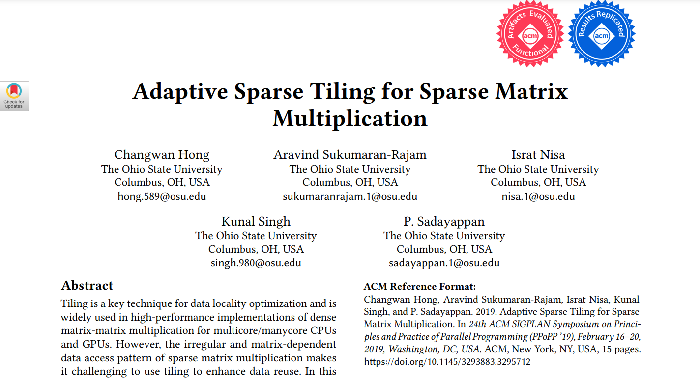
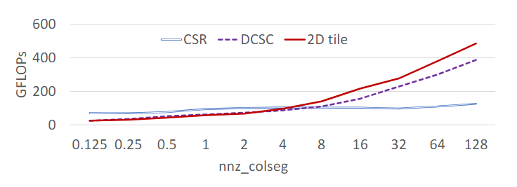

# 用于稀疏矩阵乘法的自适应稀疏分块方法

**Adaptive Sparse Tiling for Sparse Matrix Multiplication**

论文于2019年发表在PPoPP '19: Proceedings of the 24th Symposium on Principles and Practice of Parallel Programming.

## 摘要

分块(Tiling)是数据本地性优化的关键技术, 广泛应用于多核/众核CPU和GPU的高性能实现中. 然而,
稀疏矩阵乘法不规则和矩阵依赖的数据访问模式使得使用分块来增强数据重用变得困难.
在论文中, 设计了一种自适应分块策略, 并将其应用于两个基本操作:SpMM(稀疏矩阵-稠密矩阵乘法)和SDDMM(
采样稀疏矩阵-稠密矩阵乘法). 使用了标准的压缩稀疏行(CSR)格式, 并在其中进行行内重排以实现自适应分块. 使用来自Sparse
Suite集合的大量矩阵进行实验评估, 表明与当前可用的最先进替代方案相比, 性能有了显著的提升.

---

## 引言

分块是有效利用数据重用的关键技术, 在所有高性能的密集线性代数计算, 卷积神经网络, 模板计算等的高性能实现中都有应用.
虽然对于此类规则计算的分块技术已经被充分理解和广泛应用, 并且在多核CPU和GPU上的高性能实现中得到了大量的使用,
但是将分块技术有效应用在稀疏矩阵乘法(SpMM)上却仍然存在挑战.

在稠密矩阵的分块中, 均匀分块是常见的做法, 其中所有分块(除了边界分块)具有相同数量的操作和相同的数据占用. 然而, 对于稀疏矩阵的分块,
由于稀疏矩阵在二维索引空间中非零元素的分布非常不均匀, 不同大小的分块中非零元素的数量会有明显的差异.
分块方法是否比非分块方法更能实现高性能取决于该区域的稀疏结构.

在论文中, 开发了一种自适应稀疏分块(ASpT)方法, 用于对SpMM(稀疏矩阵-稠密矩阵乘法)和SDDMM(采样稠密矩阵-稠密矩阵乘法)进行分块.
一个关键思想是, 二维块中每个"活跃"行/列段(至少包含一个非零元素)的平均非零元素数量在决定二维块的分块执行或非分块执行的优劣方面起着重要作用.
稀疏矩阵被划分为行面板, 每个行面板中的活动列要么被分组为二维分块以进行分块执行, 要么由于其活动列密度不足而被分配到非分块执行.

---

## 背景及相关工作

### 标准稀疏矩阵表示

CSR(Compressed Sparse Row)表示法

---

## ASpT概述

本节概述了ASpT(自适应稀疏分块)方法, 这是一种使用无序压索稀疏行(CSR)表示法进行稀疏矩阵乘法分块的执行策略.

### 数据重用的潜力

对于一个 N×N 的带状稀疏矩阵, 假设带宽(带状矩阵的"带宽"是矩阵中心对角线左右两边包含非零元素的宽度)为B. 意味着每一行最多有B个非零元素.
总共N行, 因此矩阵的总非零元素约为N×B. 与大小为N×K的稠密矩阵进行矩阵乘法运算, 对于每个非零元素, 需要进行K次乘法和K-1次加法,
因此总的浮点运算次数约为2×N×B×K. 每个元素为单精度浮点数, 占用4字节.

- 对于稠密输入矩阵$D$和稠密输出矩阵$O$都是$N \times K$的矩阵.
    - 所需的储存需求为: $4 \cdot N \cdot K + 4 \cdot N \cdot K$ bytes
- 对于稀疏输入矩阵$S$ 总共有$N \cdot B$个非零元素. 在CSR储存表示中, 每个非零元素还有一个对应的列索引(数量为$N \cdot B$),
  和行偏移数组(数量为$N + 1$).
    - 所需的总储存需求为: $4 \cdot N \cdot B + 4 \cdot N \cdot B + 4 \cdot (N + 1) \approx 4NB + 4NB + 4N$ bytes

矩阵运算所需的储存总需求可以表示为: $4NK + 4NK + 8NB + 4N$, 提取N为公因子再忽略影响较小的项,
可以得到近似表达式: $8N(K + B)$

数据重用的度量方式是操作强度(Operational Intensity), 即:

- $OI = \frac{浮点运算次数}{内存传输量(字节数)}$

> 数据重用的概念是, 如何在计算过程中尽量多次重复利用已经加载到缓存中的数据.

对于 $N \times K$的稠密矩阵和$N \times B$的稀疏矩阵, 浮点运算次数约为 $2NBK$, 而总内存传输量约为 $8N(K + B)$. 因此,
理论上的最大$OI$为:

- $OI_{max} = \frac{2NBK}{8N(K + B)} = \frac{BK}{4(K + B)} $ 倒数求和的形式: $\frac{1}{\frac{4}{B} + \frac{4}{4K}}$

因此, 随着带宽$B$的增加, $OI_{max}$会增加. 在实际测量的数据中显示, $OI$首先随着B的增加而增加，然后由于L2缓存容量的限制而减少。

当算法在遍历稀疏矩阵$S$的行时, 如果某一行的非零元素对应的列被多次访问之间的间隔过大(即在访问同一列之前,
访问了太多其他行的列数据), 则对应的稀疏矩阵$D$的列数可能会被从缓存中移除(cache eviction). 这会导致$D$的数据重用性显著降低,
因为数据需要频繁从主存中重新加载, 而不能充分利用缓存中的数据.

所以稀疏矩$S$的稀疏结构(非零元素的分布模式)直接决定了算法访问稠密矩阵$D$列的顺序和频率. 如果$S$的非零元素分布稀疏且不均匀,
则稠密矩阵$D$的列数据在缓冲中可能很快失效, 重用性下降.
如果$S$的非零元素集中在某些行或列, 则稠密矩阵$D$的重用性会显著提高.

---

### 三种数据访问方案对比

默认情况下, 按照行顺序(row-wise)访问稀疏矩阵$S$的非零元素, 这可能导致$D$的列数据在缓存中的重用率低.
为了实现稠密矩阵$D$元素更好的重用, 必须改变稀疏矩阵$S$元素访问顺序.

**按列访问(Column-wise Access)**: 完全按列访问$S$可以实现对$D$的列元素的最大化重用, 从而降低数据传输量,
但是可能会导致输出矩阵$O$的重用率下降. 因为$O$的每个元素需要在最内层循环中多次累加更新, 无法保持在缓存或寄存器中,
增加了缓存失效(cache miss)的可能性.

**DCSC表示的列内按行访问(Column-wise Access within Row-panels)**: 通过将$S$分为多个行面板(row-panels),
然后在每个行面板中按照列的顺序访问. 使用双压缩稀疏列(DCSC)表示法, 将$S$的非零元素按照列分组压缩储存.
列内按行访问的模式可以让稠密矩阵$D$的列数据部分重用, 通过限制列访问的范围, 保持$O$的部分重用. 但是,
DCSC的列访问模式导致单词操作设计的非零元素数量较小(列密度较小).

> 行面板(row-panels)是指针对稀疏矩阵$S$的行进行分块, 一个行面板是由稀$S$中连续的若干行组成的子块. 如果矩阵$S$
> 的大小是$M \times N$, 每个行面板包含$P$行, 那么$S$可以被分为$M/P$个行面板.

**二维分块(2D Tiling)**: 将稀疏矩阵$S$划分为多个二维块(2D tiles), 然后对每个块的非零元素按照行顺序处理. 同时考虑了$D$
和$O$的重用性. 每个二维块中, 稠密矩阵$D$的列数据和输出矩阵$O$的行数据可以在寄存器中重用. 但是,
二维分块的性能依赖于稀疏矩阵$S$的非零元素分布. 如果矩阵的非零元素非常稀疏, 某些二维块可能空置, 浪费计算资源.

三种方案的性能对比

---

ASpT方案基于以下观察: 当二维分块中的列具有足够高的nnz_colseg,

---

## 总结

论文链接: [Adaptive Sparse Matrix-Matrix Multiplication on GPUs](https://dl.acm.org/doi/abs/10.1145/3293883.3295712)