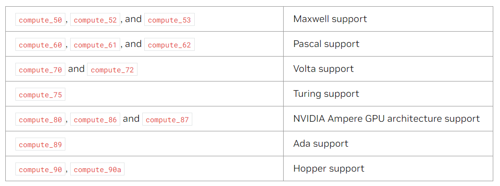
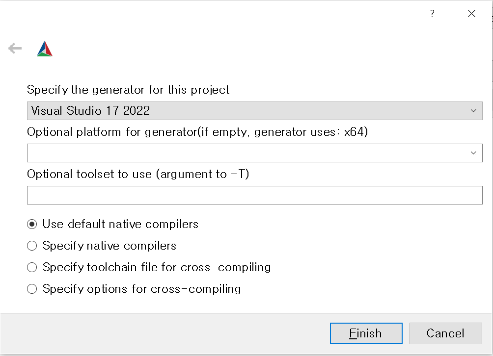
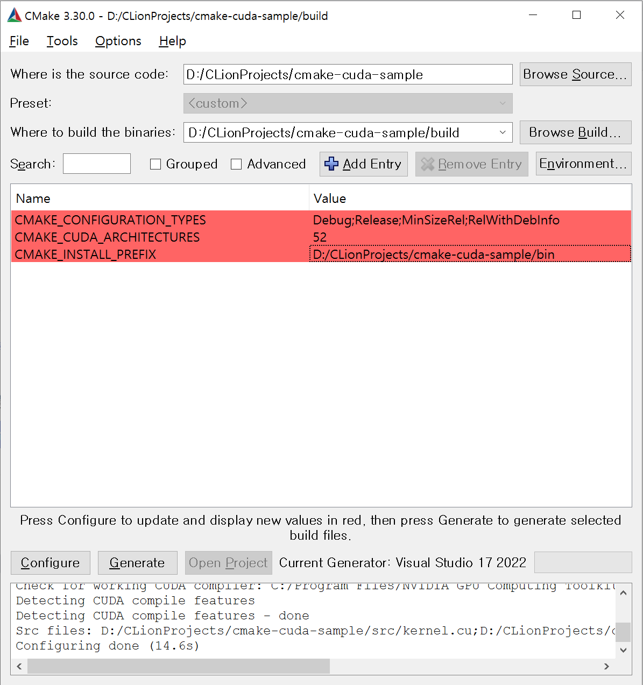
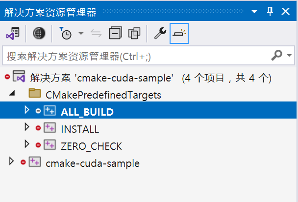

# 用 CMake 构建跨平台 CUDA C/C++ 项目

***

## 前言

NVIDIA 官方 [cuda-samples](https://github.com/NVIDIA/cuda-samples) 项目和一些论文的源码中都使用的是 Make 构建, 导致每换一台主机都得重新设置, 太麻烦了. 所以写一遍 CMake 方便构建, 同时顺便记录一下要点.  

本文先解释了为什么要使用 CMake 来构建 CUDA C/C++ 项目. 创建一个项目框架, 一步一步讲解如何手动使用 CMake 构建一个 CUDA C/C++ 项目, 并指出构建 CUDA 项目额外需要的步骤.

***

## 为什么使用 CMake

编译CUDA代码可以使用 `nvcc` 工具直接在命令行输入命令进行编译.

```shell
$ nvcc main.cu -o main
```

但编译多个文件的时候就需要给每个文件都只编译源码, 最后再一起生成可执行文件.

```shell
$ nvcc -c kernel.cu -o kernel.o
$ nvcc -c main.cu -o main.o
$ nacc kernel.o main.o -o main
```

实际工程中, 文件数量会非常非常多, 一个个手动调用 `nvcc` 编译链接会变得非常麻烦.

使用 g++ 编译 C++ 项目时同样有这个问题. 为了实现自动编译, 发明了 Make 这个程序. 要使用 Make, 需要创建 Makefile 文件并在文件中写出不同文件之间的依赖关系和生成各文件的规则, 然后只需要输入一个 `make` 命令就能完成构建.

然而 Make 在 Unix 类系统上是通用的, 但是在 Windows 则并不是. 并且Make工具也有分好几种, 例如 GNU Make, QT 的 qmake, 微软的 MS nmake 等等. 这些 Make 工具遵循着不同的规范和标准, 所执行的 Makefile 格式也千差万别. 如果软件想跨平台, 则必须要保证能够在不同平台编译, 要使用上面的 Make 工具自动完成构建, 就得为每一种标准都分别写一次 Makefile文件.

为了解决以上这个问题, 就有了跨平台的CMake.


CMake 是一个跨平台的自动化构建系统, 用来管理软件构建的程序, 并不依赖于某特定编译器. CMake 并不直接建构出最终的软件, 而是产生标准的建构档(如Unix的Makefile或Windows的Visual C++的projects/workspaces), 然后再依一般的建构方式使用.

*CMake 相当于对 Make 进行了封装. 让开发者可以只编写一次构建脚本就能在不同的平台上构建软件, 从而实现"Write once, run everywhere". 使用统一的格式编写配置文件(CMakeLists.txt), 就能够在不同环境和平台上生成所需的本地化 Makefile 和工程文件.*

*CUDA 也加入了 CMake 支持的各种语言, 平台, 编译器和 IDE.*

> CMake 广泛用于 C 和 C++ 语言，但它也可用于构建其他语言的源代码.

***

## 安装工具

要使用CUDA, 当然首要至少要有一个NVIDIA的GPU设备. 然后安装以下工具 :
- CUDA Toolkit : [Download CUDA Toolkit](https://developer.nvidia.com/cuda-toolkit)
- CMake : Linux(Ubuntu)系统可以通过命令sudo apt install cmake安装. 推荐去官网下载新版本后安装 [Download CMake](https://cmake.org/download/)
- C/C++ 编译器 : Linux 使用 gcc/g++. Window 推荐使用 [visual studio](https://visualstudio.microsoft.com/zh-hans/)

***

## 环境设置

*Linux(Ubuntu):*

找到设备中 CUDA 安装目录 (默认安装在 `/usr/local/` ).  根据本机的 CUDA 安装路径, 在 `.bashrc` 文件中手动添加 CUDA 库文件到环境变量 `PATH` .

```shell
export PATH=/usr/local/cuda-12/bin/:$PATH
export LD_LIBRARY_PATH=/usr/local/cuda-12/lib64:$LD_LIBRARY_PATH
```

当然保存后还需要加载一次配置

```shell
$ source ~/.bashrc
```

*window:*

安装 CUDA Toolkit 后检查有没有将CUDA库目录添加到环境变量Path. 如果没有则需要手动添加.

> 设置->系统->关于->高级系统设置->环境变量->系统变量->Path->编辑->新建

```
C:\Program Files\NVIDIA GPU Computing Toolkit\CUDA\v12.5\lib
C:\Program Files\NVIDIA GPU Computing Toolkit\CUDA\v12.5\libnvvp
```

***

## 构建项目框架

创建 include 文件夹用来包含项目头文件, 创建 src 文件夹来包含项目源文件, 创建 CMake 配置文件: `CMakeLists.txt` .

```
.
├─include
│  ├─
└─src
│  ├─
└─CMakeLists.txt
```

> 要编译其他项目只需要将项目源文件复制到 src 文件夹, 头文件复制到 include 文件夹, 并稍作修改 CMakeLists.txt 文件就行.

***

## CMakeLists.txt

使用 CMake 构建一个最简单的项目只需要在配置文件(CMakeLists.txt)中包含三个基本命令:
- `cmake_minimum_required()` : 指定CMake最低版本号
- `project()` : 设置项目名称
- `add_executable()` : 使用指定的源代码文件创建可执行文件
- 
下面一步一步讲解如何在配置文件中构建一个 CUDA C/C++项目, 并指出构建 CUDA 项目额外需要的步骤.

***

### 设置CMake版本

首先使用 `cmake_minimum_required()` 指定使用的 CMake 最低版本号, 如果使用的 CMake 版本低于指定的最低版本号, 构建过程可能会失败或不兼容.

```cmake
cmake_minimum_required(VERSION 3.26)
```

>3.26 版本是一个较新的稳定版本.
>CMake 从3.11版本开始支持 CUDA.

***

### 创建项目

*`project()` 设置项目名称. 括号里填写项目名, 并将其存储在变量PROJECT_NAME中.*

```cmake
project(cmake-cuda-demo)
```

***

### 启用语言支持

*`enable_language()` 用以添加构建项目使用的语言.*

```cmake
enable_language(CXX)
enable_language(CUDA)
```

> 也可以简化在 project() 项目名后添加, 例如: project(cmake-cuda-demo CUDA CXX).

> 在 CMake 3.10 版本前, 不能通过 enable_language(CUDA) 来添加 CUDA, 需要使用 find_package(CUDA)或 find_package(CUDAToolkit)来添加 CUDA 包.

***

### 设置 C++ 标准

*`set()` 用于定义/修改变量值.*

要使用 C++ 的一些新特性则需要指定 C++ 标准, 通过 CMake 内置变量 CMAKE_CXX_STANDARD 设置项目使用的 C++ 标准.

```cmake
set(CMAKE_CXX_STANDARD 11)
```

> 通过设置变量 CMAKE_CXX_STANDARD_REQUIRED 为 ON 可以强制使用指定的 C++ 标准. 如果编译器不支持指定的 C++ 标准, CMake 构建过程将报错

***

### 选择 CUDA 架构

*变量 `CMAKE_CUDA_ARCHITECTURES` 是 CMake 3.18 版本中加入的一个变量, 用于指定编译 CUDA 代码时支持的 GPU 架构, 如果要使用新架构的一些特性, 则必须要指定特定的架构.*

例如要使用Volta架构开始引入的Tensor core, 则需要指定70及以上架构.

```cmake
set(CMAKE_CUDA_ARCHITECTURES 70)
```

>通过NVIDIA驱动的 `nvidia-smi` 命令能查看GPU信息, 或直接输入 `nvidia-smi -q | grep Architecture` 查看架构信息. 具体架构和对应的参数可以参考下表 :


GPU架构和对应的参数列表

***

### 添加变量

*添加创建的 include 文件夹路径储存到变量 `INCLUDE_DIR` , 添加 src 文件夹路径储存到变量 `SRC_DIR` .*

```cmake
set(INCLUDE_DIR "${CMAKE_SOURCE_DIR}/include")
set(SRC_DIR "${CMAKE_SOURCE_DIR}/src")
```

> 变量 `CMAKE_SOURCE_DIR` 是 CMake 的内置变量, 储存最外层 CMakeLists.txt 文件所在的目录. 如果项目有多个子目录和子 CMakeLists.txt 文件, `CMAKE_SOURCE_DIR` 始终指向最外层的路径. `CMAKE_BINARY_DIR` 则对应子 CMakeLists.txt 文件的路径.

***

### 生成文件列表

*使用 `file(GLOB)` 可以根据指定的模式匹配文件名，并将匹配到的文件列表赋值给一个变量.*

读取 src 文件夹的 CUDA, C,  C++源文件储存在变量 `SRC_FILES` 中.

```cmake
file(GLOB SRC_FILES "${SRC_DIR}/*.c" "${SRC_DIR}/*.cpp" "${SRC_DIR}/*.cc" "${SRC_DIR}/*.cxx" "${SRC_DIR}/*.cu")
```

> 使用 file(GLOB_RECURSE) 可以递归搜索目录及其所有子目录中的文件

***

#打印信息
*`message()` 用于在 CMake 的构建过程中输出信息, 可以使用它来打印出变量的值, 或检查调试信息.*

可以用于检查上个命令中变量 `SRC_FILES` 是否包含了目标源文件.

```cmake
message(STATUS "Src files: ${SRC_FILES}")
```

- `STATUS` : 显示一般状态信息
- `WARNING` : 显示警告信息
- `FATAL_ERROR` : 显示错误信息并停止 CMake 进程
- `SEND_ERROR` : 显示错误信息但继续 CMake 进程

还可以配合条件语句来检查 CUDA 是否被正确添加.

```cmake
if (CMAKE_CUDA_COMPILER)
message(STATUS "nvcc path : ${CMAKE_CUDA_COMPILER}")
else ()
message(WARNING "nvcc not found. Please check CUDA is installed correctly!")
endif ()
```

> 当然了, 如果没有正确添加, 在 `enable_language(CUDA)` 就会报错, 这里只是给出示例

***

### 添加构建目标

*`add_executable()` 用以向项目中添加要从源代码构建的可执行目标. 一个配置文件中可以添加多个目标.*

```cmake
add_executable(${PROJECT_NAME} ${SRC_FILES})
```

***

### 添加 CUDA 头文件

*使用 `target_include_directories()` 可以为目标项目添加头文件目录, 使编译器可以找到目标所依赖的头文件.*

添加 CUDA 头文件目录和 include 文件夹. `CUDA_INCLUDE_DIRS` 是CUDA包中的内置变量, 储存了CUDA头文件的路径. 再使用前面定义好的 `INCLUDE_DIR` 变量.

```cmake
target_include_directories(${PROJECT_NAME} PRIVATE ${CUDA_INCLUDE_DIRS})
target_include_directories(${PROJECT_NAME} PRIVATE ${INCLUDE_DIR})
```

- `PRIVATE` ：链接的库仅对目标自身可见
- `PUBLIC` ：链接的库对目标自身和链接到该目标的所有其他目标都可见
- `INTERFACE` ：链接的库仅对链接到该目标的其他目标可见

> 全局添加使用 `include_directories()` 命令. 当有多个目标需要构建, 并且需要包含相同的头文件路径时, 全局添加可以减少重复的代码. 但在大多数情况下推荐使用局部添加, 能使项目的依赖关系更加明确.

***

### 链接 CUDA 库文件

添加完头文件还需要使用 `target_link_libraries()` 指定目标项目在链接时需要使用的库文件.

使用储存了 CUDA 库文件目录的变量 `CUDA_CUDART_LIBRARY` 来链接 CUDA 库文件.

```cmake
target_link_libraries(${PROJECT_NAME} PRIVATE ${CUDA_CUDART_LIBRARY})
```

> `target_link_libraries()` 也可以在一条命令中添加多个库文件, 中间用空格分开.

> 全局添加使用 `include_directories()`.

cuBLAS 和 cuSPARSE 等库包含在 CUDA Toolkit 包中, 如果要使用它们, 只需要链接对应的库文件.

```cmake
# Linked cuBLAS library
target_link_libraries(${PROJECT_NAME} PRIVATE ${CUDA_cublas_LIBRARY})

# Linked cuFFT library
target_link_libraries(${PROJECT_NAME} PRIVATE ${CUDA_cufft_LIBRARY})

# Linked cuSOLVER library
target_link_libraries(${PROJECT_NAME} PRIVATE ${CUDA_cusolver_LIBRARY})

# Linked cuSPARSE library
target_link_libraries(${PROJECT_NAME} PRIVATE ${CUDA_cusparse_LIBRARY})

# Linked cuRAND library
target_link_libraries(${PROJECT_NAME} PRIVATE ${CUDA_curand_LIBRARY})
```

> 如果要使用cuDNN库, 则需要去官网下载 cuDNN: [Downloads cuDNN](https://developer.nvidia.com/cudnn-downloads), 设置好环境, 然后查找 cuDNN 包并添加头文件目录和库文件.

以上源码可在Git上获取: [GitHub - CX9898/cmake-cuda-sample](https://github.com/CX9898/cmake-cuda-sample)

***

## 构建

目前很多IDE都支持 CMake, 可以实现一键构建, 比如我现在用的 CLion. 但是有时候还是需要手动构建, 这里用来记录一下.

*Linux(Ubuntu):*

在项目文件夹中创建并进入 `build` 文件夹, 然后运行 `CMake ..` 和 `make` :

```shell
$ mkdir build
$ cd build
$ cmake ..
$ make
```

最终在 build 文件夹中就会生成可执行文件:


> 也可以直接使用 `cmake --build build` 来创建 build 文件夹并开始构建.

*window:*

首先选择 CMakeLists.txt 文件所在的路径.


选择构建的位置. 选择在项目目录中创建的 build 文件夹.


选择完后点击 `Configure` 按钮.


选择编译器, 推荐使用 [visual studio](https://visualstudio.microsoft.com/zh-hans/). 然后点击 `Finish` .



可以在变量 `CMAKE_INSTALL_PREFIX` 中设置要安装的路径, 然后点击 `Generate` 开始构建.



构建成功后, 旁边的 `Open Project` 按钮也亮了, 点击 `Open Project` 进入编译器开始编译.

右边的解决方案资源管理器中选择 `ALL_BUILD` , 右键选择 `生成` .



`ALL_BUILD` 完成后, 项目目录的 build 文件夹中的 Debug 目录里就已经生成可执行文件了.


要编译 Release 版本只需要构建前在变量 `CMAKE_CONFIGURATION_TYPES` 中设置为 `Release` 即可.

在解决方案资源管理器中选择 `INSTALL` , 右键选择 `生成` , 就可以将可执行文件安装到指定目录.

***

## 扩展

### OpenMP

*OpenMP(Open Multi-Processing) 是一个并行API，用于在C/C++程序中方便地实现多线程编程.* 如果要加入OpenMP库, 则需要先找到 OpenMP 包再添加 OpenMP 库文件.

```cmake
# Find OpenMP package
find_package(OpenMP REQUIRED)

# Linked OpenMP library
target_link_libraries(${PROJECT_NAME} PRIVATE OpenMP::OpenMP_CXX)
```

`find_package()` 用于添加外部库或软件包, 如果有不同版本的库文件也可以指定特定的版本号.
- `REQUIRED` : 如果指定的包找不到，CMake 将报错并停止进一步的配置过程。这是确保项目依赖性的关键参数
- `QUIET` : 安静模式. 即使找不到包, CMake 也不会在控制台输出任何警告或错误信息。这通常用于可选依赖项
- `MODULE` : 告诉 CMake 查找的是 CMake 模块文件(.cmake 文件), 而不是包配置文件

> 注意: OpenMP主要用于在 host 端并行化 CPU 代码, 需要在C++源文件中使用.

**添加其他第三方库(例如Boost, HDF5)时一般也是按照先用 find_package() 找到对应软件包, 再用 target_include_directories() 和  target_link_libraries() 添加对应的头文件和库文件.**

***

### 安装设置

**CMake 也可以指定安装规则. 当使用 cmake 产生 Makefile 后, 还可以通过执行make install命令来将编译生成的可执行文件, 库文件, 头文件等安装到指定位置.**

**使用 `install()` 来设置安装规则.** 通过设置变量 `CMAKE_INSTALL_PREFIX` 可以指定安装路径. 如果不指定路径则默认安装到 `/usr/local`.

```cmake
set(CMAKE_INSTALL_PREFIX "${CMAKE_SOURCE_DIR}")

install(TARGETS ${PROJECT_NAME} DESTINATION bin)
```

- `TARGETS` 用于指定需要安装的目标, 可以一次指定多个目标, 使用分号 `;` 分隔
- 根据目标类型, 可以使用 `RUNTIME`, `LIBRARY` , `ARCHIVE` 等关键字来指定不同类型的文件的安装规则
- `DESTINATION` 用于指定安装的目的地. 例如 `DESTINATION bin` 表示在安装路径中创建 bin 文件夹, 将目标文件安装到 bin 文件夹中

> DESTINATION也可以不使用默认的安装路径, 直接使用固定参数.
例如: `DESTINATION "${CMAKE_SOURCE_DIR}/bin"`

***

参考：

[cmake-commands(7) - CMake 3.30.0 Documentation](https://cmake.org/cmake/help/latest/manual/cmake-commands.7.html)

[FindCUDAToolkit - CMake 3.30.0 Documentation](https://cmake.org/cmake/help/latest/module/FindCUDAToolkit.html)

[Linux嵌入式：全网最细的CMake教程！(强烈建议收藏)](https://zhuanlan.zhihu.com/p/534439206)
[佳佳：学C++从CMake学起](https://zhuanlan.zhihu.com/p/657235610)

[使用 CMake 构建跨平台 CUDA 应用程序](https://developer.nvidia.com/zh-cn/blog/building-cuda-applications-cmake/)
