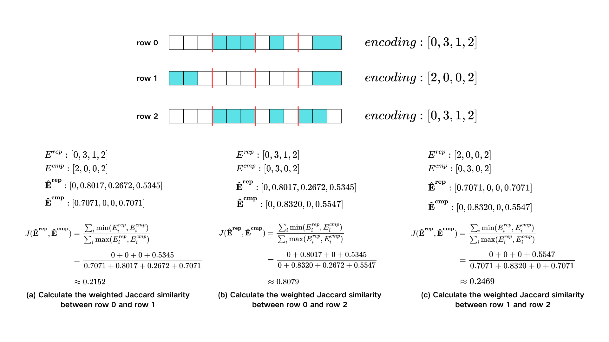
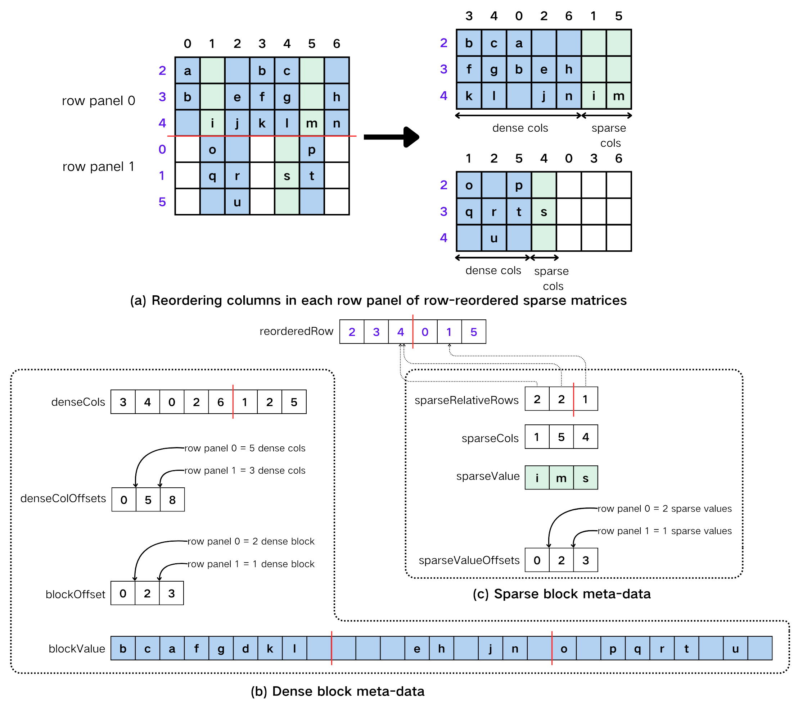

# SDDMM

---

## Implementation

在本节中,

### row reorder

为了生成更多的高密度block, 需要识别矩阵的块级稀疏模式, 将具有相同块稀疏模式的行排列在一起.

---

### col reorder

图2(a)展示了列排序的概念视图. 为了方便展示, 图中将行面板的大小设置为3, 在实际实现中则设置为16, 理由是为了最终形成多个16×16的block,
以匹配WMMA API中tf32的矩阵乘法操作的输入维度. 首先将重排序后的行分为大小为16的行面板,
计算每个行面板中每个列段的非零元素数量然后根据非零元素数量按降序排序, 将非零元素数量为0的列索引在排序前去除可以有效减少排序的时间复杂度.
规定一个稀疏阈值(), 将非零元素数量大于等于阈值()的列索引归类为dense column, 小于阈值()的列索引归类为sparse column.
各个行面板中的dense column排列在一起组成了多个dense tiled, sparse column排列在一起组成了多个sparse tiled.
其中每个dense tiled中按照16个列段为一组, 构成多个16×16的block.

阈值()的选择

---

### dense tiled和sparse tiled的数据表示

在reordered matrix的存储上, 对blocked ELLPACK(BELL)格式和COO格式进行改进, 以适应重排序后的矩阵. 
图1(b)描述了dense tiled的数据表示方法.

---

### SDDMM dense block

算法1中描述了使用Tensor core计算的SDDMM算法.

---

### SDDMM sparse block

算法2中描述了使用CUDA core计算的SDDMM算法.

---