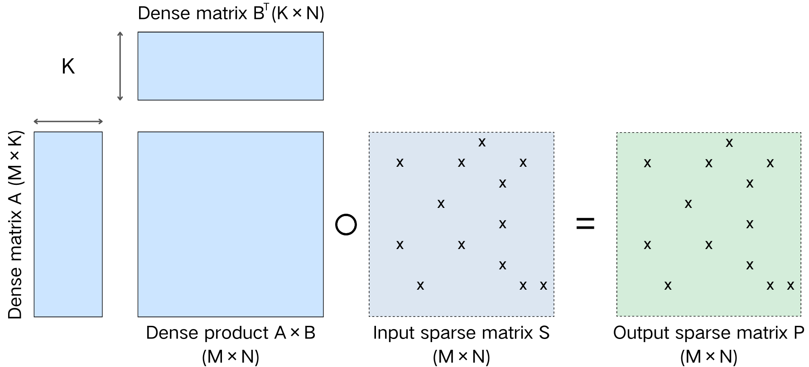

# SDDMM

---

在本文中，我们提出了一种结构化矩阵重排技术，利用稀疏矩阵的块级稀疏性来提高基于 Tensor Core 的 SDDMM
操作的性能。密集图块是通过对具有相似稀疏模式的行进行聚类和重新排列，以及根据每个行面板内的列密度重新排列列来构建的。这样可以有效提高Tensor
Cores的利用率和SDDMM运算的处理性能。

## Implementation

采样密集矩阵乘法（SDDMM）是各种科学计算和机器学习应用中的核心操作，在训练或推理期间占用大量执行时间。在 GPU 上高效并行化
SDDMM 操作对于减少许多机器学习和推理任务的执行时间至关重要。

如图 1 所示，SDDMM 运算针对稀疏矩阵 S 的每个非零位置 (i,j) 计算矩阵 A 的第 i 行与矩阵 B 的第 j 列之间的点积. 之后,
将计算结果与稀疏矩阵 S 进行 Hadamard 积(逐元素积), 生成输出矩阵 P.

近年来，随着深度学习和高性能计算的发展，Tensor Core 已成为现代GPU架构中不可或缺的计算单元。最初由NVIDIA在Volta架构中引入，
Tensor Core专为加速小规模矩阵乘加操作（Matrix Multiply-Accumulate, MMA）而设计.
Tensor Core不仅适用于深度神经网络，也可扩展到科学计算和稀疏线性代数等领域。尤其在稀疏矩阵乘法中，
若能将计算转换为Tensor Core支持的密集矩阵块形式，即可显著提升性能.

## 相关研究

在稀疏矩阵乘法中, 若能将计算转换为Tensor Core支持的密集矩阵块形式, 即可显著提升性能, 然而, 稀疏矩阵的非结构化特性常常阻碍了Tensor
Core的利用率. 如何高效利用Tensor Core资源是当前的研究热点之一.

Hong 等人提出了 自适应分块方法（Adaptive Sparse Tiling），通过对稀疏矩阵进行行面板划分并对列段密度进行动态分类，对行面板内的列进行重排序,
形成密集分块, 然后使用针对GPU优化的矩阵乘法内核处理密集分块. 该方法在行面板内对列进行重排序, 但没有考虑行面板之间的稀疏性.

Lee等人提出了一种加速的块稀疏感知矩阵重排序方法。该方法通过分析块结构稀疏性并对行进行重排序,
旨在增加密集tile的数量，从而提高Tensor Core的使用率.

## 实现

### row reorder

为了生成更多的高密度block, 需要识别矩阵的块级稀疏模式, 将具有相同块稀疏模式的行排列在一起.

首先，将稀疏矩阵S中的每行按一定大小分成若干列块，计算每个列块的非零元素的数量。 根据加权jaccard相似性公式（1）对所有行逐行进行比较。
规定相似度阈值，低于阈值则认为不相似，超过阈值则认为相似，并排列在一起。

---

### col reorder

重新排列行之后，将行分成若干个 16 个尺寸的面板。将行面板大小设置为 16 的原因是为了匹配 TF32 Tensor Core 操作支持的
16×16×8 尺寸。按每行面板列间隔中非零元素的数量降序排序。
指定一个稀疏度阈值，如果某列中非零元素的数量大于或等于该阈值，则认为该列是稠密的, 否则认为该列是稀疏的。
每个行面板中的密集列排列在一起形成dense tiled，而稀疏列排列在一起形成sparse tiled。
Dense tiled使用 Tensor Core 计算，sparse tiled使用通用 CUDA Core 计算。

图2(a)展示了列排序的概念视图. 为了方便展示, 图中将行面板的大小设置为3, 在实际实现中则设置为16, 理由是为了最终形成多个16×16的block,
以匹配WMMA API中tf32的矩阵乘法操作的输入维度. 首先将重排序后的行分为大小为16的行面板,
计算每个行面板中每个列段的非零元素数量然后根据非零元素数量按降序排序, 将非零元素数量为0的列索引在排序前去除可以有效减少排序的时间复杂度.
规定一个稀疏阈值(), 将非零元素数量大于等于阈值()的列索引归类为dense column, 小于阈值()的列索引归类为sparse column.
各个行面板中的dense column排列在一起组成了多个dense tiled, sparse column排列在一起组成了多个sparse tiled.
其中每个dense tiled中按照16个列段为一组, 构成多个16×16的block.

阈值()的选择

---

### dense tiled和sparse tiled的数据表示

在reordered matrix的存储上, 对blocked ELLPACK(BELL)格式和COO格式进行改进, 以适应重排序后的矩阵.
图1(b)描述了dense tiled的数据表示方法.

---

### SDDMM dense block

算法1中描述了使用Tensor core计算的SDDMM算法.

将dense tiled分成多个 16×16 dense block并以改进的 BELL 格式存储。使用 WMMA API ,让每个warp计算一个dense block. 由于dense
block的行和列已经重新排序，并不连续，因此需要读取的矩阵A和B的数据也不连续。为了形成 Tensor Core 可以读取的连续内存，必须将矩阵
A 和 B 的数据加载到共享内存中。算法 1 描述了基于dense tiled的 SDDMM 计算.

---

### SDDMM sparse block

算法2中描述了使用CUDA core计算的SDDMM算法.

为了在稀疏平铺 SDDMM 计算中实现有效的负载平衡，非零元素以 COO 格式存储。在 COO
格式中，每个非零元素具有相同的计算量。一个线程计算一个非零元素的方式的问题在于，非零元素的行或列是不同的，这使得全局内存访问位置不规则，从而引起大量的内存访问发散。
为了减少这种内存差异，让两个线程一起计算单个非零元素，在这种情况下，需要进行归约操作来合并两个线程的计算结果。
使用 warp shuffle 指令有效地执行此操作。算法 2 描述了基于稀疏平铺的 SDDMM 计算。

---

## 实验

---

## 结论

在本文中，我们提出了一种结构化矩阵重排技术，以最大限度地提高 Tensor Core 在 SDDMM
操作中的利用率。该方法分析了稀疏矩阵的块级稀疏性，对具有相似结构的行进行聚类和重新排列，然后根据每个行面板中列的密度将列重新排列在一起，以将它们分离为密集块和稀疏块。这使我们能够配置针对
Tensor Cores 优化的密集块，并通过异构使用 Tensor Cores 和 CUDA Cores 同时提高计算性能和资源利用率。

---