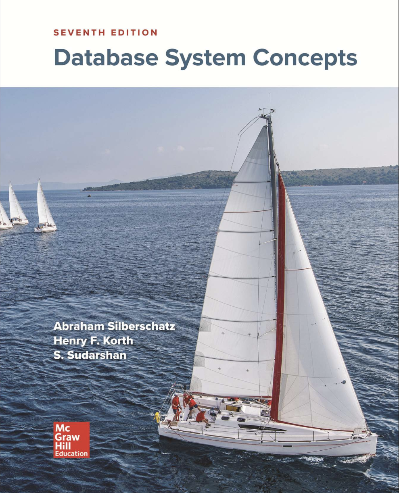
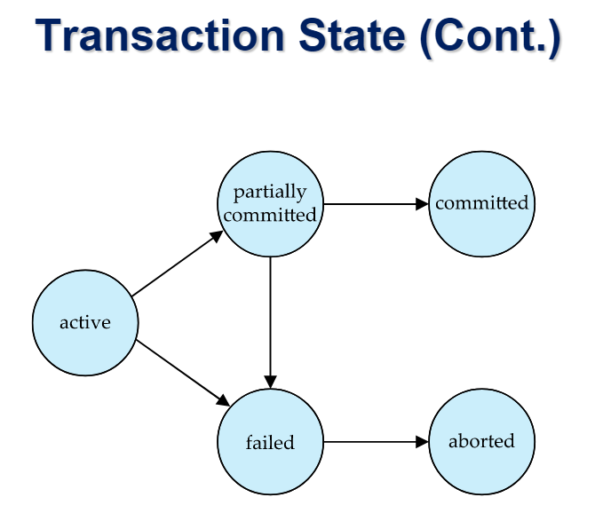
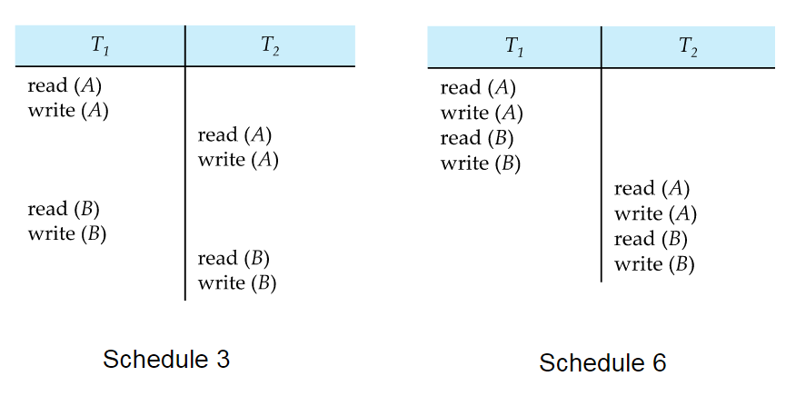
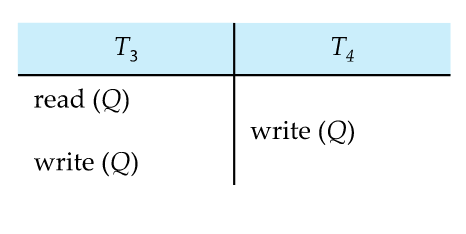
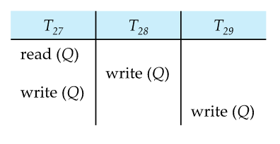
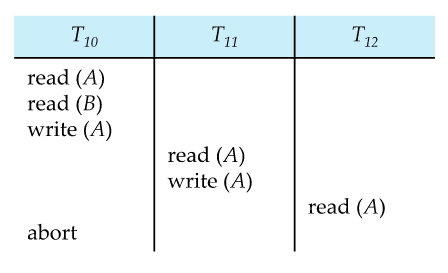

# 高级数据库

---

[Database System Concepts](https://codex.cs.yale.edu/avi/db-book/)

---

## 17章: 交易

概述:

- [交易的概念](#交易的概念)
- [交易状态](#交易状态)
- [并发执行](#并发执行)
- [可串行化](#可串行化)
- [可恢复性](#可恢复性)
- [隔离的实施](#隔离的实施)
- [SQL中的事物定义](#SQL中的事物定义)
- [可串行化的测试](#可串行化的测试)

### 交易的概念

Transaction Concept

**交易**是程序执行的一个单元, 它访问并且可能更新各种数据项.

为了保证数据的完整性, 数据库系统必须确保:

- 原子性: 要么事务的所有操作都在数据库中得到正确反映, 要么全部操作都不反映
- 一致性: 孤立地执行一个事务可保持数据库的一致性
- 隔离性: 尽管多个事务可能并发执行, 但每个事务都必须对其他并发执行的事物一无所知
- 持久性: 交易成功完成后, 对数据库所做的更改会得以保存, 即便出现系统故障也是如此

### 交易状态

Transaction State

- 活动: 初始状态; 事务在执行期间一直处于此状态
- 部分提交: 在执行完最后一个语句之后
- 失败: 在发现正常的执行流程无法继续进行之后
- 已终止: 在事务已回滚且数据库恢复到事务开始前的状态之后.
    - 事务终止后有两个选择:
        - 重新启动交易(只有在没有内部逻辑错误的情况下)
        - 终止交易
- 已提交: 在成功完成之后

### 并发执行

Concurrent Executions

系统中允许多个事务同时运行.
优点在于:

- **处理器和磁盘利用率高**, 带来了更高的交易吞吐量
- 交易的平均响应时间缩短: 短交易无须等待长交易

并发控制方案(实现隔离的机制)

- 要控制并发事务之间的交互, 以防止它们破坏数据库的一致性

调度: 一系列指令，指定了并发事务的指令以何种时间顺序执行.

- 一组事务的调度必须包含这些事务的所有指令。
- 必须保持每个单独事务中指令出现的顺序。

如果一个事务成功完成其执行，它将有一个提交指令作为最后一条语句。

- 默认情况下，假定事务执行提交指令作为其最后一步。

如果一个事务未能成功完成其执行，它将有一个中止指令作为最后一条语句。

### 可串行化

Serializability

基本假设: 每笔交易都保持数据库的一致性

一组事务的串行执行保持了数据库的一致性

如果一个(可能是并发的)调度等同于一个串行调度, 那么它就是可串行化的.
调度的不同等值形式引发了以下概念:

- 冲突可串行化
- 视图可串行化

#### 冲突可串行化

两个操作被认为是冲突的三个条件:

- 属于不同的事务
- 在同一个数据项上执行
- 至少有一个操作是写操作

如果通过一系列非冲突指令的交换操作, 一个调度S能够被转换为一个调度s', 我们就说S和S'是冲突等价的.

如果一个调度S与一个串行调度在冲突方面等价, 那么就说该调度是"冲突可串行化"的.

通过一系列非冲突指令的交换, 调度表3可以转换为调度表6, 即一个连续的调度表, 其中T2遵循T1.
因此, 调度表3是"冲突可串行化"的.

不可"冲突可串行化"的调度示例:

#### 视图可串行化

**视图等价**:
如果两个调度在对每个数据项的读写操作上是一致的，那么它们就是**视图等价**
的。这意味着，尽管两个调度可能在事务的执行顺序上有所不同，但它们对于数据库中每个数据项的最终状态的影响是相同的.

如果一个调度S与某个串行调度是视图等价的, 那么这个调度S就是视图可串行化的.

每一个冲突可串行化的调度也是视图可串行化的.

以下是一个可视图串行化但不可冲突可串行化的示例:

#### 可串行化的测试

先行图的构建步骤:

- 顶点(Vertices): 图中的每个顶点代表一个事务. 例如, 如果有事务T1, T2, ..., Tn，那么图中就会有相应的n个顶点.
- 边(Arcs)：如果两个事务Ti和Tj之间存在冲突, 并且Ti在Tj之前访问了引起冲突的数据项, 那么我们就在Ti和Tj之间画一条有向边.
  从Ti指向Tj.
- 边的标签(Labels)：每条边可以被标记上引起冲突的数据项,以明确指出是哪一项数据导致了这两个事务之间的冲突.

先行图与可串行化:

- 无环属性：如果一个调度是可串行化的，那么其对应的先行图应该是无环的。这是因为在串行调度中，事务是顺序执行的，不存在循环依赖的情况。
- 检测环：通过检查先行图中是否存在环，我们可以判断一个调度是否可串行化。如果图中存在环，那么这个调度就不是可串行化的，因为环表示事务之间存在循环依赖，无法找到一个满足所有事务冲突要求的串行顺序。

### 可恢复性

Recoverability

需要处理事务失败对并发运行的事物的影响.

可恢复调度: 如果一个事务Tj读取了一个数据项, 该数据此前是由Ti写入的, 那么Ti的提交操作会出现在Tj的提交操作之前.

以下调度属于无法恢复

如果T8应该终止, T9可能会读取到不一致的数据库状态. 因此, 数据库必须确保调度是可恢复的

**级联回滚**: 单个事务故障会导致一系列事务回滚.
以下调度中所有事物都尚未提交(因此该调度是可恢复的)

缺点是可能导致大量工作的付诸东流

### 隔离的实施

Implementation of Isolation

隔离级别的实现:

- 锁定
    - 对整个数据库进行锁定与单个项目进行锁定
    - 保持锁定状态多久?
    - 共享锁与独立锁
- 时间戳
    - 分配交易时间戳, 例如在交易开始时
    - 数据项储存两个时间戳
        - 读取时间戳
        - 写入时间戳
    - 时间戳用于检测无序访问
- 每个数据项的多个版本
    - 允许事务从数据库的"快照"中读取数据

### SQL中的事物定义

Transaction Definition in SQL

在SQL中, 事务是隐式开始的.

在SQL中, 一条事务以以下方式结束:

- 提交工作, 提交当前事务并开始新事务
- 回滚操作, 会导致当前事务终止

在几乎所有数据库系统中, 默认情况下, 如果每条SQL语句执行成功, 也会隐式提交.

---

## 18章 并发控制

概述:

- [基于锁的协议](#基于锁的协议)
- [基于时间戳的协议](#基于时间戳的协议)
- [基于验证的协议](#基于验证的协议)
- [多钟粒度](#多钟粒度)
- [多版本方案](#多版本方案)
- [插入和删除操作](#插入和删除操作)
- [索引结构中的并发](#索引结构中的并发)

### 基于锁的协议

Lock-Based Protocols

锁是一种控制对数据项的并发访问的机制

数据项可以以两种模式锁定:

- 独占(X)模式. 数据既可以读取也可以写入.
- 共享(S)模式. 数据项只能读取.

向并发控制管理器发出锁定请求. 只有在请求获得批准后, 事务才能继续进行.

### 基于时间戳的协议

Timestamp-Based Protocols

### 基于验证的协议

Validation-Based Protocols

### 多钟粒度

Multiple Granularity

### 多版本方案

Multiversion Schemes

### 插入和删除操作

Insert and Delete Operations

### 索引结构中的并发

Concurrency in Index Structures